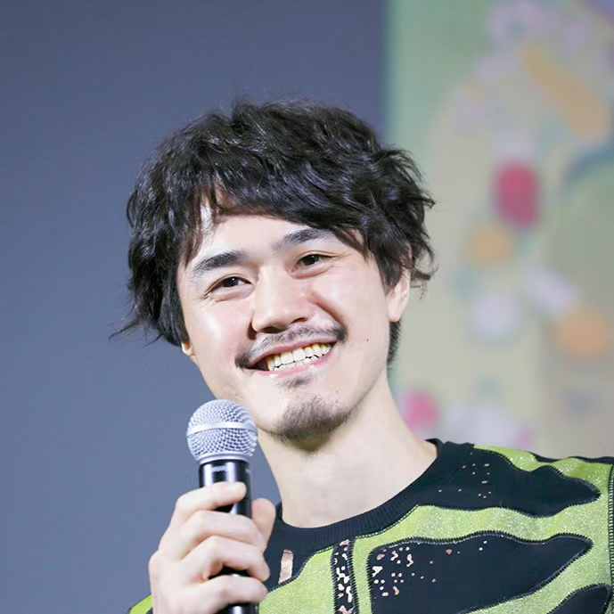
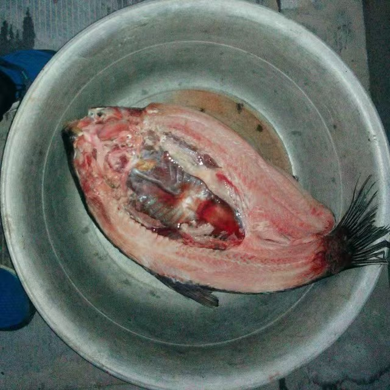
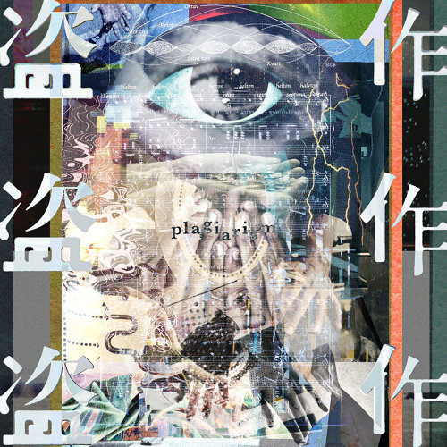
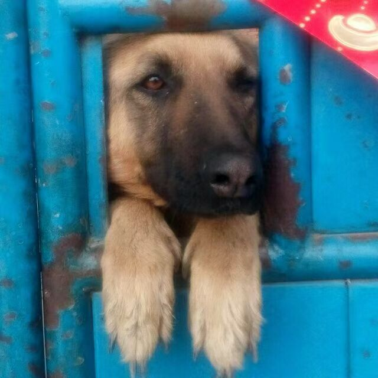
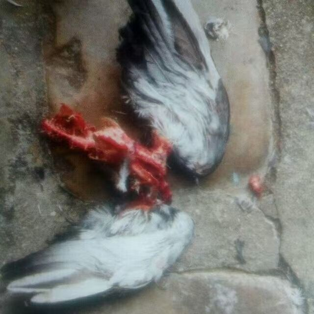

# 个人信息

- 姓名：张陶然
- 性别：男
- 生日：19990816

## 姓名

### 张陶然

这名字还挺女性化的。据我爸妈说是翻字典正好翻到「陶然」那页。

但据我推测，是因为，我爸姓「张」，我妈姓「陶」。

### Calvino

取自意大利作家[伊塔洛·卡尔维诺](https://zh.wikipedia.org/zh-cn/%E4%BC%8A%E5%A1%94%E7%BD%97%C2%B7%E5%8D%A1%E5%B0%94%E7%BB%B4%E8%AF%BA)的姓氏，虽然一般也不会有人拿别人的姓当名字。

心目中最伟大的作家，无需多言。~~其实是濑户口廉也~~

### 废良

Neta自摇滚乐队《美好药店》的歌曲[《废梁》](https://music.163.com/#/song?id=26494735)。~~不建议听~~

起初想表达的是废除乡愿，消弭伪善良民之意。

若允许断章取义，则亦可表示「觉悟当念还，鸟尽废良弓」。

抑或再度延伸，表示格雷欣法则「劣☆驱逐良☆」。

### りゅうめい

竜(Ryuu)鳴(めい)，小孩子不懂日语起着玩的。

正好有部老动画叫[龙鸣](https://zh.wikipedia.org/zh-cn/%E9%BE%99%E9%B8%A3)(ドラゴノーツ -ザ・レゾナンス-，DRAGONAUT THE RESONANCE)，可惜是片假，无法参考。

本人不听大陆说唱，且该用词源于抽象文化，并无对特定职业的侮辱。

## 头像

- QQ头像
    - 近几年不再更换，现为《Mother》(《地球冒险》)  
{width=20%}
    - 曾用过动画监督押山清高，家中现杀活鱼  
{width=20%}
{width=20%}

- VX头像
    - 时常发电更换，现为很喜欢的女歌手DAZBEE的专辑[Orbit](https://www.youtube.com/watch?v=Ms-erjYcECU)内附图 ~~砂嵐天下第一~~  
{width=18%}
    - 曾用过夜鹿专辑[《盗作》](https://www.youtube.com/watch?v=CS4f3jawFxY)，GalGame[《白日梦的构想图》](https://laplacian.jp/yonagi/zh-cn/)，《艾尔之光》角色[露](https://zh.moegirl.org.cn/zh-hk/%E9%9C%B2_%E5%B8%8C%E5%B0%94)的表情包  
{width=20%}
{width=35.5%}
{width=20%}

- B站头像
    - 现为以前拍的乡下老舅家的大黄狗，可惜狗狗已经寄了  
{width=20%}
    - 曾用过杂志《目客lens》猫猫特辑中一只被吃完还剩下完整翅膀的鸽子，但被审核干碎了  
{width=20%}