# 福音书

~~锐评与暴言~~

## 孤独摇滚 e12
定位  
同季度 DIY手工少女 向山进发
制作人 梅原翔太 动工出身叫好不叫座  
在CW 奇蛋物语 更衣人偶  

萌系四格 空气系 寡淡 整体轻松范围+可爱角色  
靠角色魅力吸引 有意减少负面要素甚至虚无  
不带脑子 适合上班族

鼻祖 阿兹漫画大王 jk日常萌系 系构大河内  
模仿者 日常(致敬) 向阳素描 kon 点兔  
摇曳露营(重露营)  
明日酱的水手服(女性制作团队刻画少女心)

主题

1.  孤独 易感同身受 喜欢网上自己 插嘴大音量 抵触多人 进门犹豫
2.  反差搞笑 白日梦 人设化学反应+自身反差

不跳脱四格却做得耐看 归功于制作组
作画
e5live 梅原访谈 动捕+虚拟摄像机
全手绘 3DCG辅助 乐器需要专业视频  
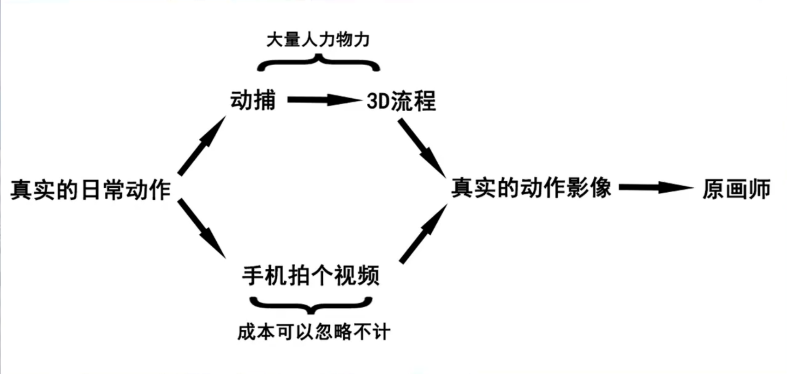

后续原画归纳模型动作并补足细节如表情
反例 高校之神 正例 赛马娘2
虹夏转身 视频辅助 吉川知希原画

演出
实拍 不一定省成本
放开了在萌系动画中表现崩坏/不可爱表情
监督 斋藤圭一郎 喜欢(兼具叙事)偏广角镜头
演出过剩问题 画面演出超脱剧情内容
如 喜剧罐头笑声 天籁人偶 突然精致催泪

e8神回  
e3e4搞笑巅峰 后转主角团成长文戏  
副监督称e8为总力战  
回收早期伏笔 吉他英雄的实力+救场英雄  
被照顾阴角反差热血 全程低头演出沉浸  
专门录制失败演奏 (虽然耳拙听不出来)  
庆功宴写实风大叔npc牢骚 (波奇爸却无脸)  
与萌系漫画刻意减少男性存在感相悖  
居酒屋内对话搞笑 屋外严肃谈心  
波奇第一次获得实力认可 虹夏坚定梦想  
角色间距离拉近 台词和演出质朴真诚  

e12拉片  
TV动画一集有三四分钟值得拉就不错了  
大部分靠动画人肌肉记忆想当然 如怼脸特写
神作也有注水过渡回  
  
从上方打光 光影真实感 (后续不必要则减少)
画面上半部留白  
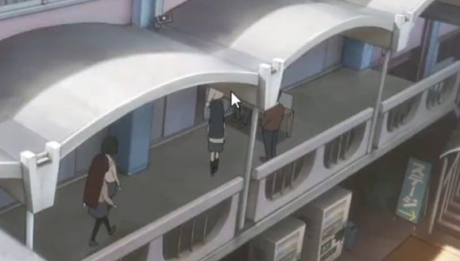
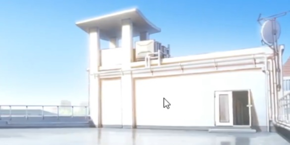  
各种空镜头 有e1广角的感觉 多花样不重复  
灰色路人 芳文常用 衬托特定npc  
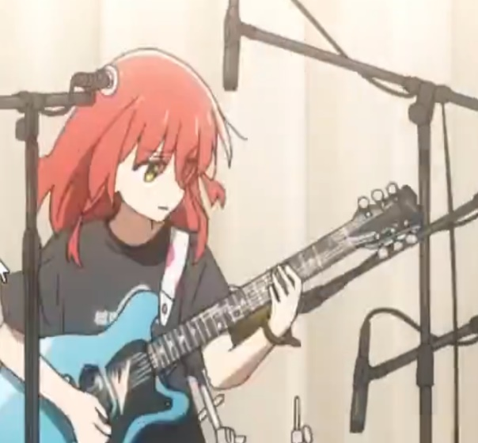 

断弦桥段 喜多代为solo 运镜特写  
  
放下罐头 solo结束  
  
松一口气  
后续不停切角色镜头 展示团体  
拍专业乐队视频参考模型动作 画师才能画出细节  
反例 凉宫春日  

把重要live放片头很有勇气  
大部分人被出乎意料会不满 与制作意图相悖  
台下观众回应的音响真实现场感 不像录音室  
波奇跳水失败 但真正觉得搞笑的人少数

保健室病床镜头 收起窗帘右侧光照
e10类似镜头重复多达4次(暗室) 工作量问题  
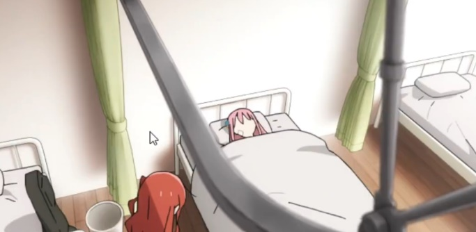  
相比于拍摄更困难的刁钻广角 工作量巨大
铁架子分隔角色用意未表明
TV动画后期工期紧往往发力不足
BTR则e12也有e1的有趣感
镜头做到自然是最难的  
  
原作也有此画面 弱化男角色存在 且动作丰富
核心竞争力是搞笑 部分特写会画得可爱
没有偶像包袱的角色作画 随意感  
  
回忆小人扒住头发的巧思  
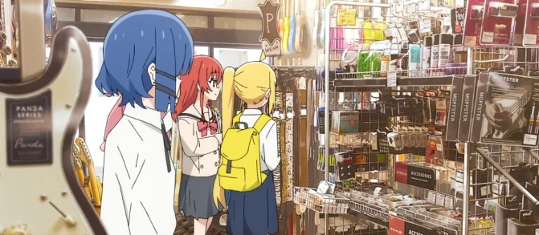
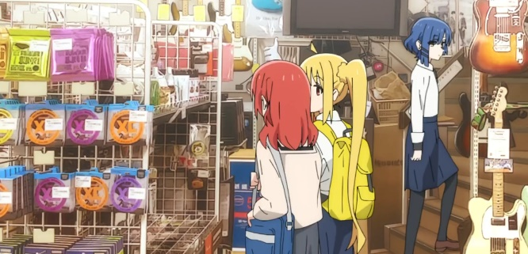  
乐器行 逼仄室内多元素 layout要求极高
构图要求高 监督作画
若照片做背景需加糊滤镜 摇曳露营是参考手绘 

  
别致的木偶演出  
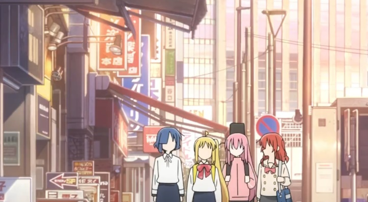  
有生活感的广角 普通自然却透出完结气息  
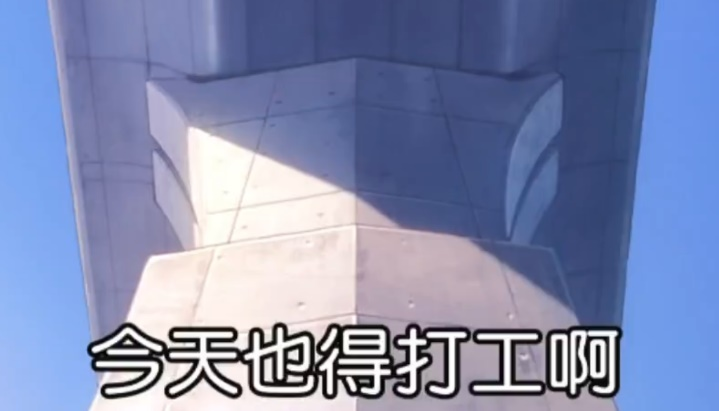  
日常片的基调的收束

## 23年4月番总结

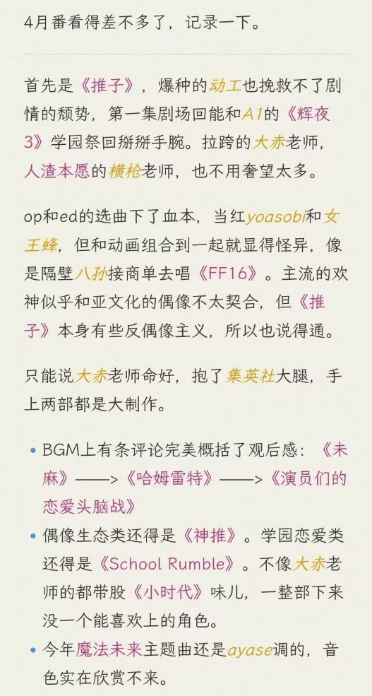{width=49%}
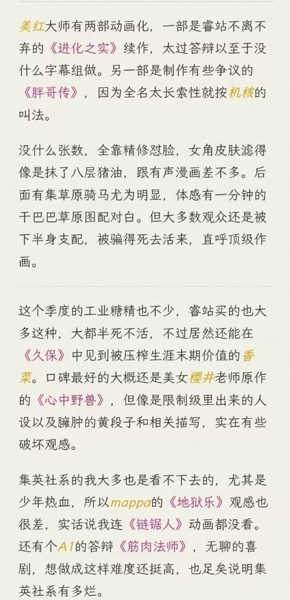{width=49%}
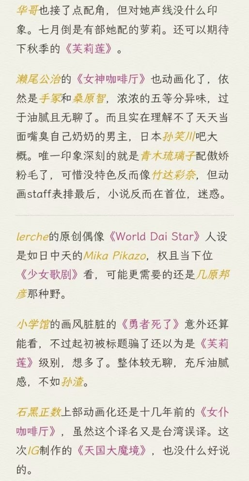{width=49%}
{width=49%}

## 轻小说与刻奇

看《弱角友崎》有感

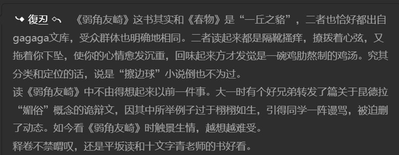{width=80%}
