# 游戏经历

## Steam

[游戏猩红热狗屎](https://steamcommunity.com/profiles/76561198347502371/)
> Neta自车牌翻译的《喷神詹姆斯》的《地球冒险》那期，英文为Game Fever  

先贴点steam游戏库的截图吧，没什么3A

趁阿根廷改价前囤了一堆游戏，比如轨迹全系列，但至今未下载
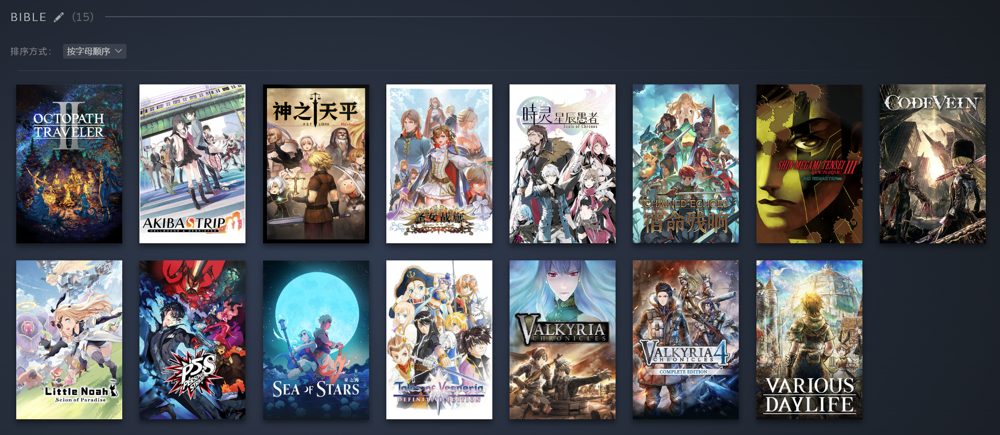{width=100%}
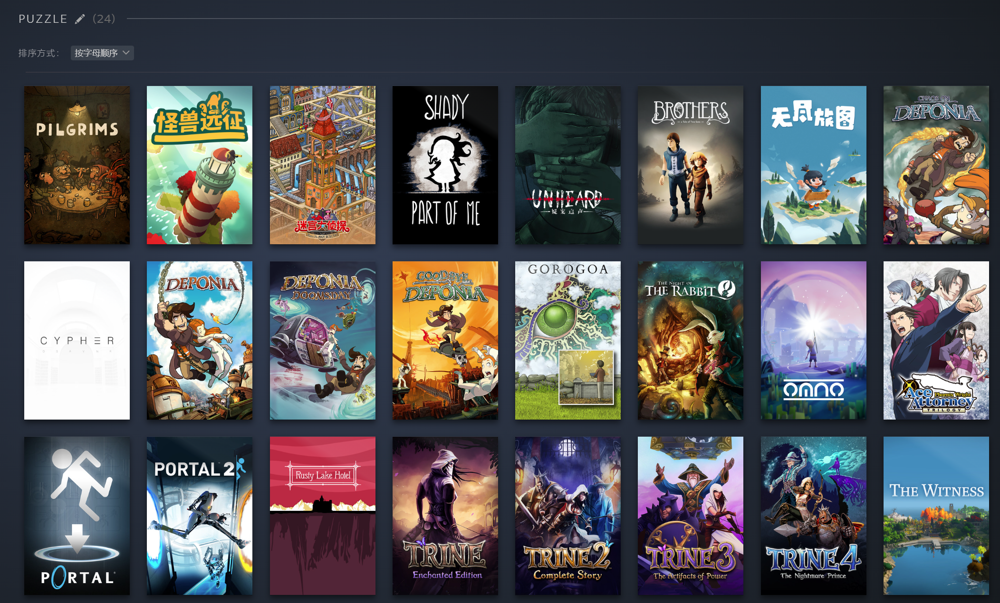{width=100%}
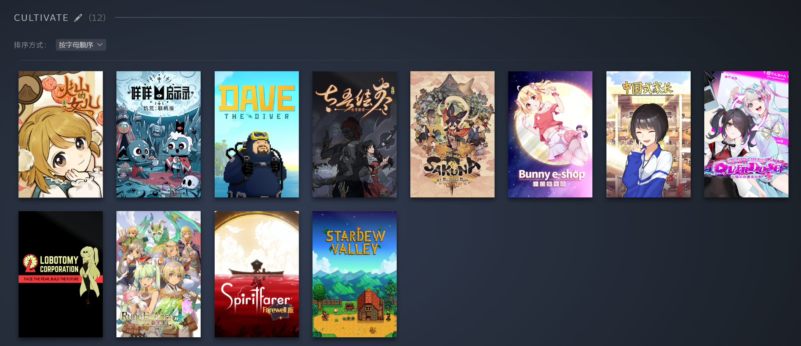{width=100%}
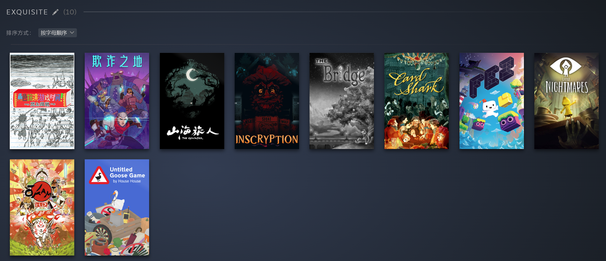{width=100%}
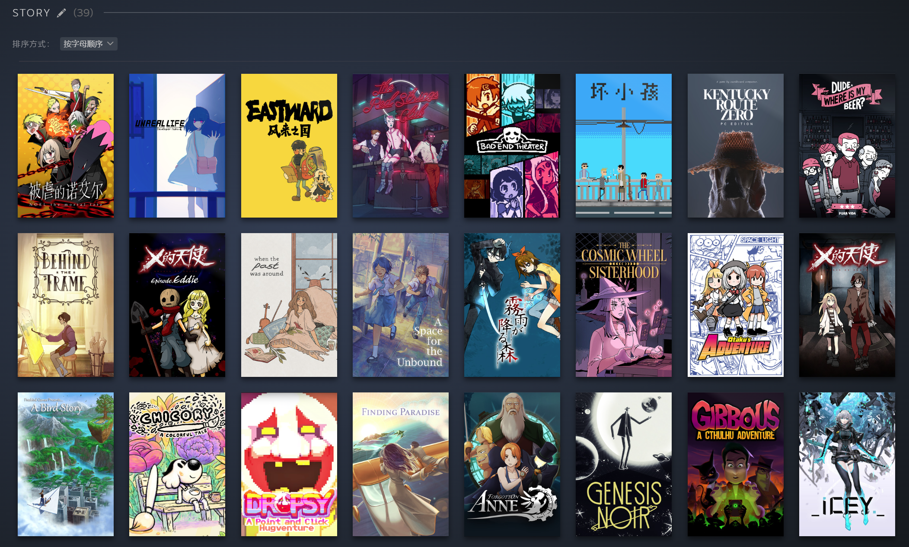{width=100%}
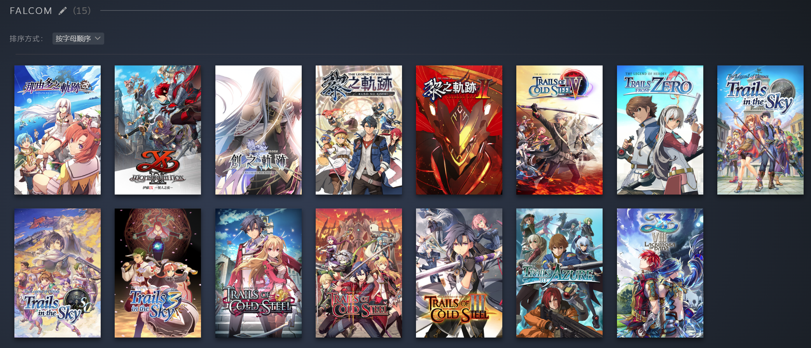{width=100%}
2024年通关目标

- [ ] ヒラヒラヒヒル
- [ ] 露露亚的炼金工房～亚兰德之炼金术士4
- [ ] 最终幻想 X
- [ ] 八方旅人 2
- [ ] 无垠之心
- [ ] 如龙8
- [ ] 碧蓝幻想Relink

## Nintendo Switch

已经只玩《有氧拳击》初音未来版了

2024年通关目标

- [ ] 塞尔达传说：王国之泪 目前80h刚开始火神兽，已打完水神兽
- [ ] 异度神剑3 角色好感等支线还没清完
- [ ] 猎天使魔女3 进度0
- [ ] 火焰纹章：契约 进度0

## 手游

有男不玩忠实拥趸

### 崩坏3

应该是投入最多的手游了，无论是时间还是金钱上

开服玩家，收藏度27000+，成就数322，近年SSR多S2+，多次参加测试服

玩得多的时候还会帮群友打打一档无限，现已咸鱼二档，偶尔摸个无限

一些操作强绑定帧数，我的电脑还触发不了一些BUFF(如爱酱闪接武器)，原因不明  
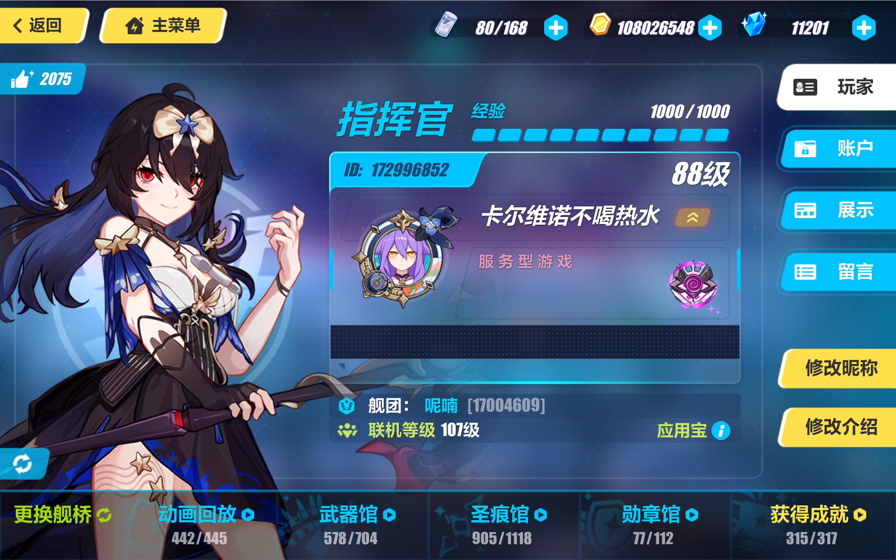{width=66%} 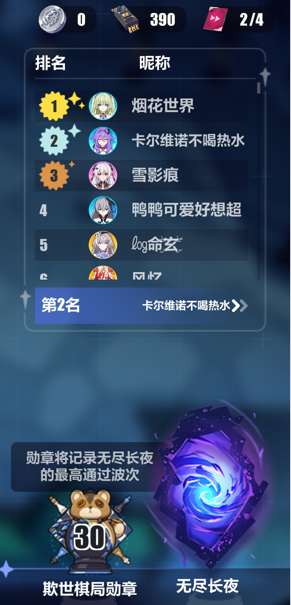{width=20%}
{width=100%}
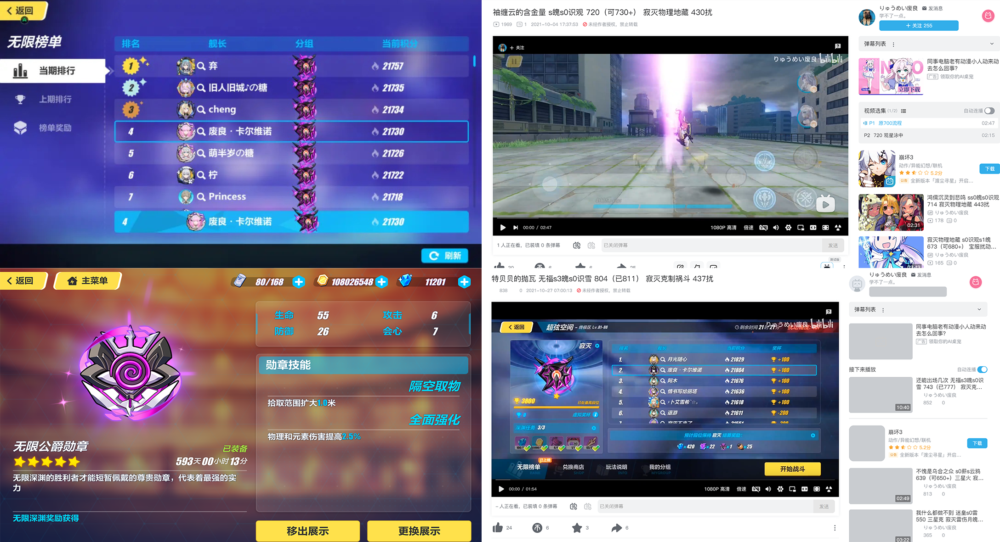{width=100%}
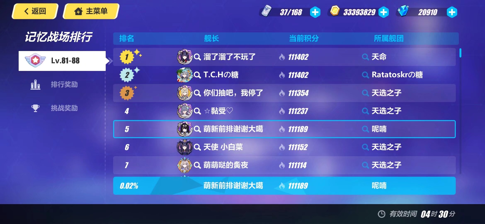{width=80%}

### 绝区零

第一次接触正统米池和圣遗物，以及漫长的养成线，确实难顶

深渊奖励太少，两周就4发多点

目前深渊能满星，但抽专武动力不足，仅鲨鱼妹抽了武器  
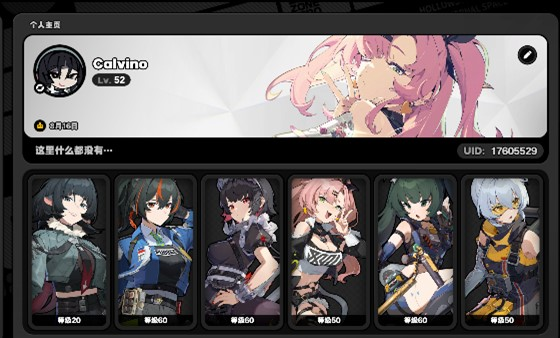{width=60%}

### 鸣潮

调整版米池和圣遗物，怀疑号是非酋号，全部大保底

深渊难度更高，敌人交互需要目押，只能21/30星

同深渊奖励太少，两周就4发多点，因此xp抽卡开始囤氵    
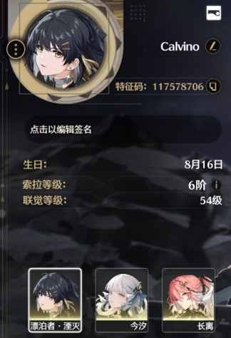{width=25%}

### 剑与远征：启程

难以拒绝的风格化美术，类自走棋放置玩法

开荒期肝度较高，但正反馈很足

现当作挂机副游，兼抽卡模拟器，不卷排名  
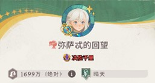{width=40%}
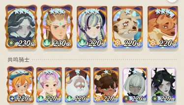{width=38%}

### 出发吧麦芬

对RO并没有情怀，外观差分吸引力有限

主要数值投放在宠物上，遂觉无聊，零氪弃坑

每日副本抢排野人大佬队是种折磨

## 端游

### 英雄联盟

初高中时作为害群之马，带着班里众多男生去网吧

精力不足，拒绝提升自我，成为大乱斗休闲玩家

斗魂竞技场模式build非常丰富，可惜没有人机  
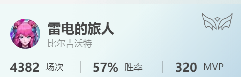{width=50%}

### 云顶之弈

Dota自走棋的究极无敌升级版，海克斯救了这个家

最喜欢S2、S5、S7，怀念沙召剑、推土机、三半神

不同区环境差异过大，电一的蛤蟆能吐死其他区的大龙不无道理

玩得最好的是S7.5，后来基本佛系大师  
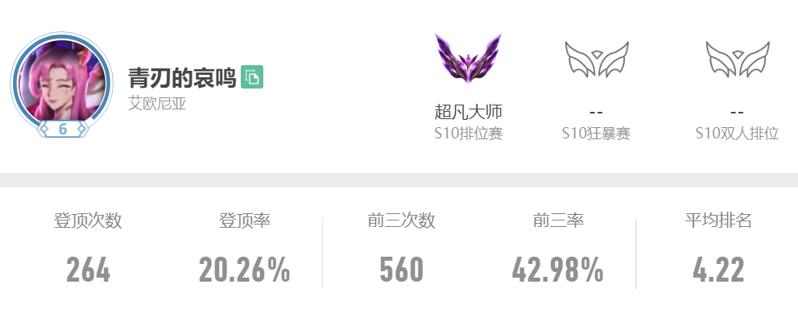{width=50%}

## 音游

Sound Voltex | DDJMAX RESPECT V | Pop'n music | 喵赛克 | 歌姬计划

~~我是街机天龙人，街机>PC>玻璃~~

鸽屋DJMAX手台吃灰中，因为手残，「だから僕は音楽ゲームを辞めた」

- 新概念音游
    - 偶像大师：星耀季节 人家是节奏游戏
    - 有氧拳击 人家也是节奏游戏

