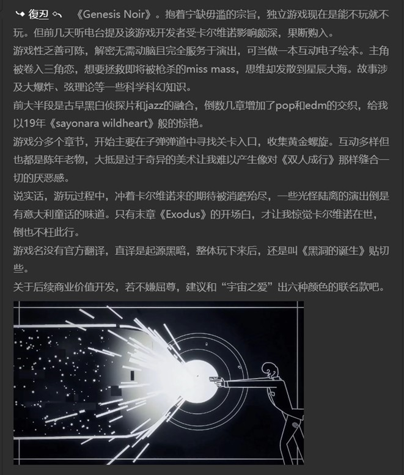
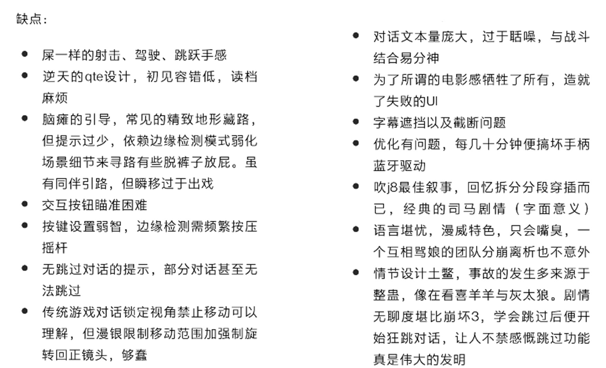
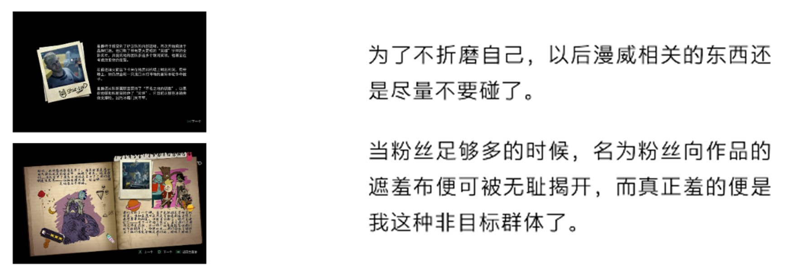

# 游玩体验

## 小作文

### 荒野大镖客2

阴雨连绵的天，总惹我不由想起《巨翅老人》，想起他那肮脏的、生着寄生虫的翅翼，虽然这和此刻瘫坐的我面前的荧屏上的一切毫不相干。

在约翰·马斯顿帮助阿尔伯特·梅森拍摄完短吻鳄照片后，“爱好者的乐土”任务4终于完成，还剩最后一部分。发呆了片刻，我义无反顾地退出并卸载了游戏，腾出了近120G内存，摆脱了硬盘空间不足的窘境。

有人说本世代最杰出的开放世界游戏非《荒野大镖客2救赎》莫属，我能理解，但属实不能苟同。

在18年“大表哥”刚发行时，我只是走马观花地管中窥豹一番，当时还无什么不好印象。于是在其19年刚上pc不久我便购入，但浅尝几小时后便投入《莎木3》的怀抱，享受了一段光怪陆离的桂林山水行。直到年底期末结束，我才重拾“大表哥”。随着数十小时的游玩后我才终于意识到：这是我目前玩过的最煎熬、最枯燥、最无聊的游戏之一。

首先是游戏本身的最外在问题，这是最简单也是最直观影响游玩体验的。“大表哥”的pc移植很敷衍，它的亮度和声音都是被阉割的。若我想在黑夜中行进，那我仅是把游戏亮度调至最大还远远不够，我还需将显示器本身亮度调高一倍，以使用别的软件无疑会瞎眼的亮度来游玩。音量方面亦然，即使游戏内和音响都调至最大也无济于事，大抵是在为西部吃不饱饭的穷苦人民发声。

其次是“大表哥”的玩法系统，令人失望。除了画面等硬技术方面的提升外，我没有看到任何玩法上的突破创新点。以开放世界的角度来说，“大表哥”还是落了窠臼，依然是强化“目标”而淡化“目的地”的类型。核心玩法还是传统的射击和潜行，“死亡之眼”的设计加入了一丝丝策略性，但也止步于此。强极的工作感，弱智的存档机制，莫名其妙的仇恨和通缉系统，这些都令人焦虑，使游玩时内心常常惴惴不安。

关于体验极差这点有件轶事。我偶然在哪篇文章上得知了“游戏猩红热”这种病症，大致是指游戏时由于神经系统的失调引发的一系列恶性症状。后来再去查找资料、找人求证，却根本无迹可寻，很可能只是一场日思夜梦的混混噩噩罢了。

再者，整个的地图设计也是不自信的，如果没有自动寻路功能，我不可能坚持下去。这样看来，精巧的电影模式所带来的演出效果也只是为自动寻路而服务，这是多么悲伤的事。游戏中真实性十足的场景也由于枯燥的游玩过程而更加令人痛苦，在主线前百分之三十多之前都没有来到圣丹尼斯这个本作中唯一的有近代气息和丰富细节的城市，而是在千篇一律的“荒原”和“农村”间奔走，“荒野”这个词的翻译就显得又牵强又令人绝望。

顺带一提的是，选择中文语言后，大地图上所标注的地名仍为以普通地图上同样方法所标注的大写字母单词，而游戏内所用地名都是翻译后的中文。因此，在想要选择传送地点等类似场景时，遇到不熟悉的目的地，我会不得不打开地图看一眼，并思考这些大写字母组合起来翻译成中文是什么意思，应该对应游戏给出的哪个地名，这无疑增加了游戏负担。

最后是在故事内容方面，非常之平庸，主线剧情甚至不如有的支线精彩，虽然元素包罗万象，台词生动考究，但掩盖不了整个主线故事的苍白。想起西部题材，本以为会似梁山好汉义薄云天，抑或是罗兰·英格斯·怀德的“小木屋”的，可都没有，前六章更像是匪贼扮家家酒。直到第七章约翰·马斯顿做主角开始的那一小段闲适的牧场生活，才让我感受到些许温暖，这时倒有了丝“小木屋”的韵味。

“大表哥”自然是个好游戏，但一言以蔽之，依然是可惜的“哪都好就是不好玩” ，工于计算地呈现出所有部分，是属于这个世代的冰冷的工业产物。打个不恰当的比方，“大表哥”更像是袁藤冲人般，中看不中用。这种大流的开放世界，想要提升趣味度也只能靠低成本的联机要素来获取与人斗的无穷乐了。但“大表哥”还是成功的，也必需成功。毕竟，好莱坞才是永远的、主流的神。

### 最后生还者2

恰逢《最后生还者2》发售一个月，热度早已消失殆尽，我也终于得以慢悠悠地通完了全部流程。

由于压根不觉得1代有什么可吹的，所以也不觉得2代有什么可喷的。大一有次历史课讲抗日的ppt我还放了1代的经典乐曲作bgm ，不过当时偌大教室也没什么反应。说实话2代广为诟病的故事反倒更刺激些，博物馆回和断指吉他回情绪渲染也十分到位，1代是真的淡出个鸟来。

这作的主题与其说是复仇，不如说是青春期。青春期的离经叛道，青春期的恣肆癫狂，青春期的妄自尊大，青春期的种种一切不成熟，终于造就了这出荒诞闹剧。别对资本主义娱乐产品抱什么期待，把这作当成郭敬明韩寒写的脚本，一切便都想得通了。

鉴于主角团的心理年龄，加之体验类和射击类杂糅的剧情驱动类型，这作完全可以用gal game的方法论来分析。好的gal game不能仅看立绘cg，还要看对白文本的茁壮与否。若一款面向尼哥需求的gal game，能让有严重歧视黑人倾向的白人对个中角色迷得死去活来，那它必然是款神作。

据国内某游戏媒体称，索尼在试玩结束后给他们提供了连线顽皮狗的机会。在被问及企划安排时，顽皮狗的人表示从一代发行后工作室便开始着手二代的开发了。再结合近几年e3先放出的主要是壮壮流程，整个游戏成现在模样也在情理之中。

大概是我已步入对影视作品都不在乎剧情的时期，真要喷的话反倒是喷玩法。精细的建模，丰富的细节，一流的AI，出色的立体箱庭，堆砌出的却是在灰暗得令人生厌的水泥森林中进行的冗长且重复度极高的无聊战斗。写实类单人射击游戏玩法的游戏性上限如此之低，且坚固得不可动摇，以至于七年了都没进步一丝一毫。

最惹人啼笑皆非的是，路径与场景的完美融合一脉相承，在这种弱hud设计下地图指引又无比难做，于是粗暴简单的嗯机械降神般的箭头标记应运而生。那箭头是那么的硕大，那么的皎白，它就那么直愣愣地出现在视野中，再配上诡异的宛若粪便坠落溅起水花的提示音，一切都显得那么的理所当然。

## 便签

### 黑暗起源
{width=70%}

### 赛博朋克2077
{width=70%}

### 漫威银河护卫队
{width=80%}

{width=80%}
{width=60%}

### 弹丸论破2
{width=49%}
{width=49%}

### 王国之泪

- 漫长的新手教程 空岛 监视堡垒 城堡 地底 四族 考虑到本作剧情驱动要素增加 也正常
    - 初始驿站的主人一直重复让去卡卡利特村 即使去了再回来文本也没改
    - 因为以为城堡是最后去所以没跟主线走 没降落伞和塔纯坐牢到哈诺特 期间甚至木板搭桥天石把咕咕鸡放上去再扭转乾坤实现起飞滑翔

- 各种bug或漏洞
    - 哈诺特牧场主对多云说天气很好
    - 卡卡利特村救活了的老奶奶在服装店外不认识我了
    - 雨林的湖畔驿站 “不能太过靠近那一侧”“望远镜……从对岸观察”疑似翻译逻辑出错
        - 井里上层靠墙有蹲着才能拾取的种子 可能是模型卡位问题
    - 跟其他驿站主人直接打招呼 或直接交互画框 驿站主人会直接叫林克名字 但第一个驿站触发首次对话会问名字
    - 不能跳跃乱踩别人床了
    - 有的送呀哈哈到朋友身边可能是随机任务 我说怎么好像有时候标记了后再回来找不到了
    - 卓拉为什么不高价收购水之果
        - 孩子们口中卓拉大王回家前的秘密去处
    - 报社多支线导致鸟人出现在不同驿站有些奇怪
        - 说在双子驿站但过去~~没人~~只有大妖精支线 原来在驿站房顶 误会了
    - 微达的独立任务挡住视线判定过迷
    - 确实有错字 反映和反应

- 操作不便
    - 究极手只有两轴 旋转体验差 解除链接晃摇杆阴间操作阴间判定（可陀螺仪）
    - 上扳机不灵 要么L点按出轮盘 要么R究极手旋转模式忽开忽关
    - 菜单材料页某一类不再横向翻页

- 操作和系统优化
    - 首次启动游戏直接过场
    - 加载界面放地图和位置
    - 烹饪料理卡片
    - 部分套装变为散件
    - 对话记录
    - 木头宝箱可破坏
    - 不倒翁当弹射板用
    - 冰盾与雷电投枪
    - 扶立牌寻找最优解 甚至可以只用马卡位
    - 先去利特村是最优路线 参照黑桐谷歌 途径龙之泪 神殿 伯库林
    - 地底世界
        - 被原友说抄袭原了

### 崩坏3第2部

- 剧情
    - 设定 悬念 人物塑造 结构 女主有配音
    - 记忆负荷高 记忆点少 表述谜语人/佶屈聱牙
    - 赫丽娅较透明 无法对标芽衣地位
    - 舰长名称如何保留 男寻梦者破坏基本盘
- 地图
    - 布局 装潢 天气 景观 小物件
    - 时间系统仅影响宿舍窗景 大厦不分昼夜
    - 箱庭解谜无聊探索驱力低
- UI/UX
    - 角色信息界面动效及姿势
    - 简化操作路径 归纳词义 鉴赏模式完善
    - 旧版老旧但独特且统一 已驯化习惯
        - 新旧杂交不伦不类 敌方血条不显眼 过于方正
        - 圣痕悬空不再植入背部
        - 角色信息查看与切换不便
    - 宿舍bgm限定播放范围
    - 再次挑战不自动升级副本难度
    - 开放世界不支持剧情重玩
- 音频
    - 配音水平高 尤其松雀
    - 早期日志回放小声bug
    - 大厦广播难以注意到
- 操作
    - 丰富战斗坐标轴维度 动作细节如希娜空钩摔地
    - 场景对话支持移动镜头
    - 跑图速度慢 战斗关仅推荐希娜
    - 手感差 反馈弱 希娜高亮按键手遮挡
- 养成
    - 新狗粮成本高 卡池机制和概率调整必定引起不适
    - 原化 缺少区分度

### Persona 5 Royal
{width=80%}
{width=89%}

