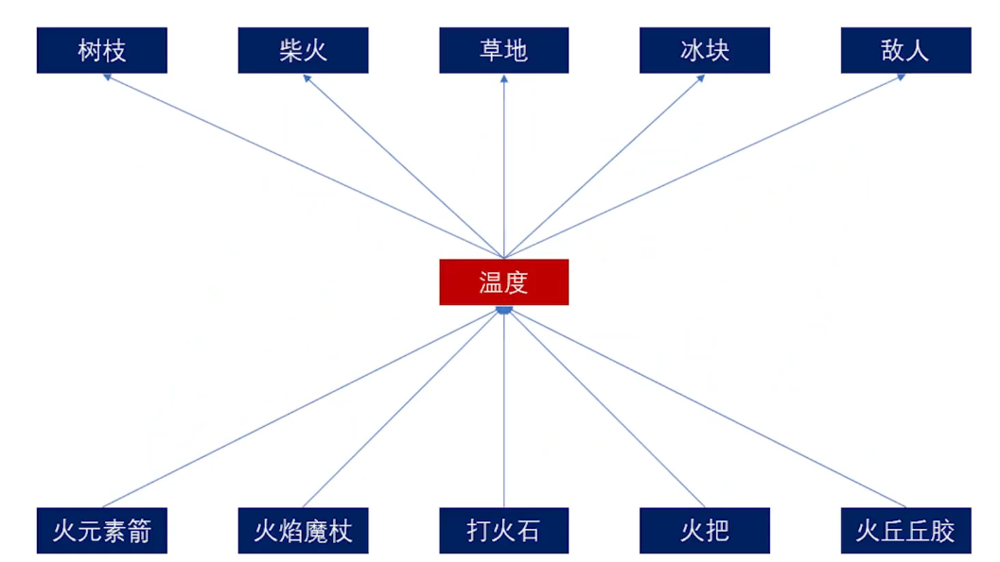
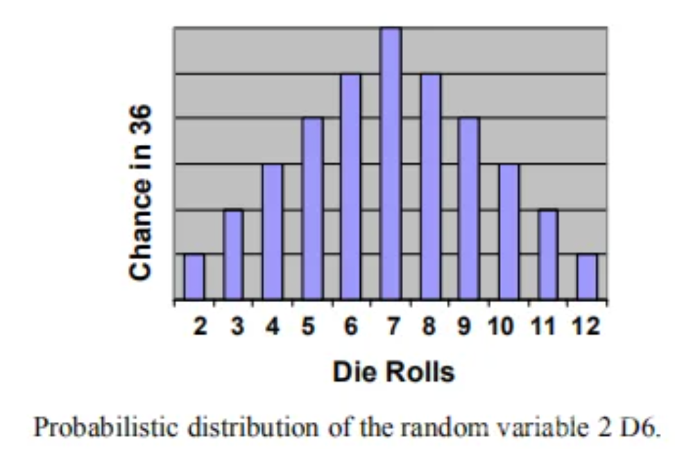
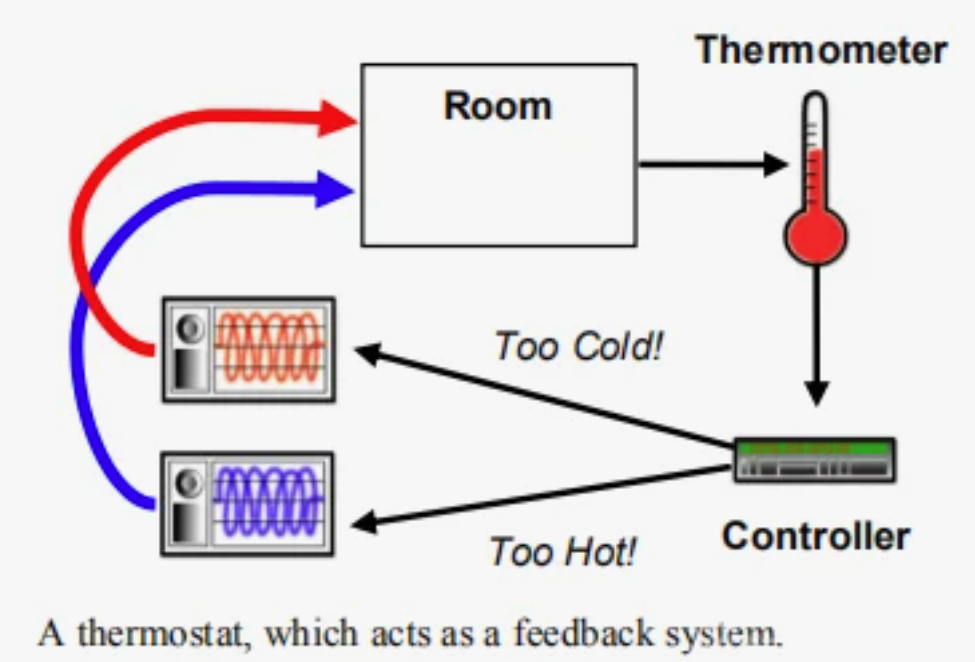
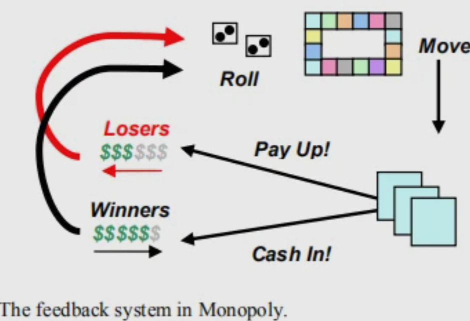
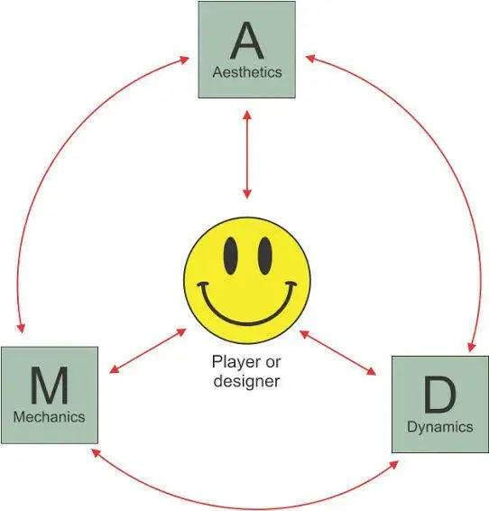
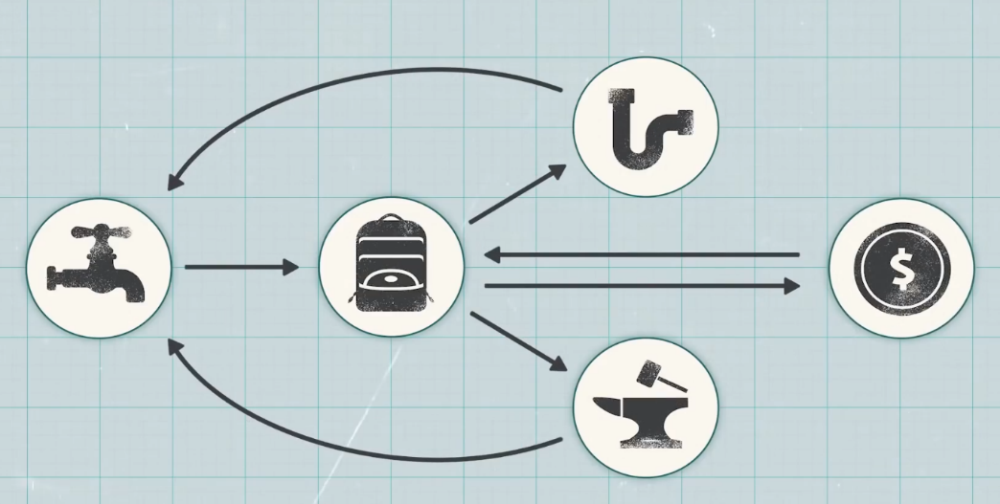
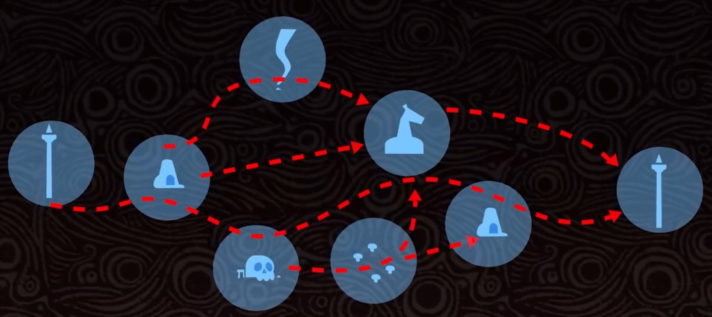
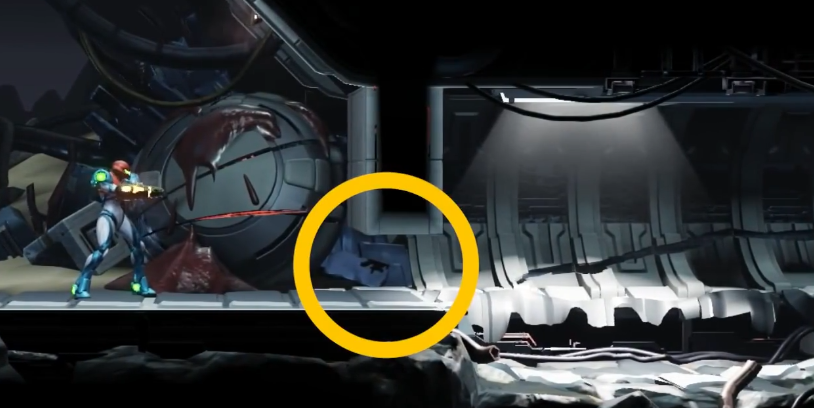
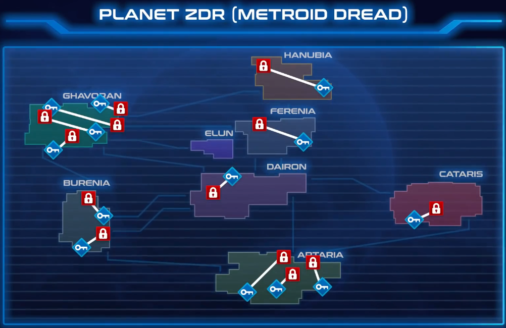
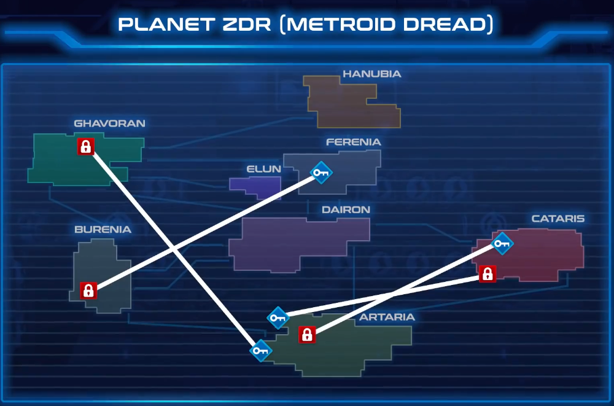

# 笔记

- [ ] OneNote转Markdown后不自动换行问题待解决

## 涌现式设计

涌现式设计Emergence  
系统中预设的简单行为互相组合影响会呈现出非常复杂的样态  
电子游戏 玩家输入行为 得到反馈——直接/涌现结果  
涌现现象 普遍存在 看似简单的元素组合后产生 超级马里奥  
涌现式设计 使用涌现和复杂性思维设计的游戏 一种设计本愿  
旷野之息 序章结束获得足以通关的所有能力   
但不同玩家解谜行为、组合方式与感受也不同  
信息时代渠道丰富 涌现设计抗住了社交网络信息洪流  
玩游戏是与设计师对话的过程 逐渐构建信任的过程  
旷野之息的信任构建过程有种优美感  
塞尔达是箱庭游戏（箱庭概念提出者——宫本茂）  
一个场景内有解决谜题的所有条件  
通过美术设计和视觉引导展现规模与边界 帮助规划游玩行为  
解谜成功进一步强化信任  
失败是玩家自身的问题 而非bug  
每次的新游戏都要从头和玩家积累信任 不能传承  
反例 北野武的挑战状 涌现失败 后期缺少前期道具 
旷野之息 放心大胆地驰骋在海拉鲁大陆上
不会担心因为没有得到某个能力必须中止自己的探索这种情况
反例 原神 以后再来探索吧
糟糕的游戏 难以理解设计师
一般的游戏 初步信任设计师
优秀的游戏 设计师真厉害
顶尖的游戏 我真厉害
逆推游戏设计 游戏原型 不拘泥形式
旷野之息 2017GDC演讲
生物学上的涌现 生命从单细胞生物迅速的演变成多种生物的过程
涌现：从混沌到有序 约翰·霍兰 
比较了显示涌现现象的不同系统和模型 展现了之间共同的规则或规律
种子长成各种植物 蚂蚁群体的智慧 围棋的多样棋局
1+1>>2
元胞自动机 离散模型 由无限个有规律、坚硬的有限状态方格组成
二进制语言与电子设备 逻辑数学
矮人要塞小猫死亡谜题 酒馆的猫死亡率高
酒馆矮人喝烈酒——打架酒洒地上——
小猫路过沾上酒——舔毛醉死在呕吐物中
多人游戏 MOBA CS
设计追求易上手难精通 任天堂特色
非涌现式设计 严格控制行为与结果
所有东西做成树状或网状触发器 文字AVG 大部分RPG
对RPG 涌现可能存在于玩法而非流程中 八方旅人打隐藏职业技巧
阶段性控制 特定商业模式的游戏
把控玩家的游戏流程 使用资源来卡住玩家从而促进付费
魔兽世界 开荒 破解游戏玩法
Roguelike 规则>故事内容 机制叙事 隐晦描述故事和世界观
素材复用 给予玩家动力
传统游戏容易变成To Do List 
花极大成本堆料也不能保证动力 3A通关率不高
涌现式设计 使玩家更主动 游玩过程本身有趣 如获取宝箱
偶然主动行为获得正反馈 实际收益反馈低
王国之泪 神庙 猜不出设计意图 但总能过关
让玩家觉得自己聪明 本质还是设计师聪明
塞尔达传说 开放世界 既涌现又堆量 密度没有下降
反例 蝙蝠侠阿卡姆系列 线性变开放后拉跨
围攻 关卡条件少 用到机制浅 缺少研究动力

旷野之息 王国之泪 没有设计传统意义上的技能
而是掌握世界规则的能力 对所有东西生效 设计一个系统
火 点东西——草、怪、材料 火把——可吹灭的点燃的木棍
简单归因 人类本能 为复杂的情境寻找简单的解释 迅速理解事物本质
涌现复杂 但设计基础符合现实抽象理解 冰火雷元素 重力
把现实机制抽象成更简单游戏逻辑 但符合底层本能 死亡变素材
火——上升气流——起飞
神界原罪2 元素交互 自洽且稳定生效 不一定要真实

路径依赖 大公司有顾虑
数值和逻辑越简单直接的游戏 涌现乐趣越直接 但是
游戏寿命/时长 和玩家破解游戏玩法系统的程度相关 玩坏
所以有的人不会去通关
涌现式设计很冒险 急速消耗游戏寿命 需要加以限制
心之容易 精力容器 衣服 电池 高维度限制
涌现引发的设计思路/启发 如血条——加减方式及条件——原因
基础功能不能太复杂 如异度神剑大量教学文本
机制不能过于简单 否则陷入负反馈循环 
玩家不进行更多尝试 只玩最优解
避免马太效应
涌现式设计需要控制
数学模型宏观调控 万智牌加快节奏
目标控制 同一结果收束行为 如神庙 数值 异星工厂
看似像涌现式设计 实际都是预设树状结构  如巫师3 密教模拟器
判断标准 规则与内容比大小
没有目标 通过涌现带来乐趣 如城镇叠叠乐 萌怪合唱团
没有涌现感 劣质Rogue 深度不够
规则冗余 设计多个规则而使整个规则集变得冗余且毫无联系
似乎一切简洁明了的规则都被穷尽了 但还是可以设计
旷野之息 能力都是常见的 并非别人没有的
简洁数值 任天堂弱数值UI 也有无聊数值交互 如料理系统
游戏结构 规则最好没有独立的 相互联系成一个箱庭结构
奥卡姆剃刀 如无必要 勿增实体
锁钥关系 一对一 递进 一对多 多对一 旷野之息 能力即钥匙

没把元素交互当作细节 而是摆在核心位置
游戏画面足够精简 大面积色块卡通渲染 
将画面中元素视觉剥离 流畅地进行判断
写实画风的游戏不合适
复杂信息量会模糊元素之间的独立感
严肃的游戏氛围难以融入创造力的游戏行为
绝大多数元素独立存在 并提供足够的交互密度与可能性
如炸弹能与一切交互 让元素尽可能关联更多 不一定要巧妙
设计宏观规则 万物法则 如温度与余温 
收纳火武器温度下降延迟 不断切换火箭会余温叠加点燃草地
冰杖——冰球——低温——冻结
岩浆——高温——死亡
沙漏状交互结构 而非点对点

弱引导 帮助充分利用规则 象征化的环境设计 敌人行为 神庙谜题
展示世界运行规律 让玩家自以为聪明 不断学习和使用 创新

交互 玩家控制一个事物与另一个事物发生作用 获得一个效果反馈
反例 火把点燃树木 火箭、龙焰则不行 降低信任
涌现式交互 事物间交互判定非预设
通过抽象封装成一层乃至多层中间概念 中间概念间接驱动交互
温度 导电 质量 究极手和左纳乌装置建造系统
玩家凭直觉尝试 游戏系统给出该有的反馈 甚至出乎意料
面向对象 处理繁杂而具备共性的问题 提取并封装简化问题
封装（高温、可燃物）——继承（岩浆的高温与流动）
——多态（性质相似而表现不同）

## MDA框架

已过气，现在是阿尔萨斯卡莱亚

MDA：游戏设计和游戏研究的一种正式方法
2001年至2004年的圣何塞游戏开发者大会 GDC Hunickeetal.,2004

游戏的消费量相对不可预测
常见信息媒体表达内容，用户被动接受
游戏更像人工制品，贩卖交互，玩家主动产生体验，无限的表达可能
游戏的行为就是游戏的内容——不是从游戏本身中流向玩家的信息媒体
游戏组件

相应设计方式

机制（Mechanics）
从数据表现和算法层面上描述了游戏的特定组件
动态（Dynamics）
描述了在一段时间内作用于玩家的输入和彼此的输出的机制的运行行为
美学（Aesthetics）
描述了当玩家与游戏互动时，在玩家身上唤起的理想的情绪反应
MDA框架的每个组成部分都可以被视为游戏的Lens
设计师的角度 机制产生动态系统行为，指动态的产生反过来又导致了特定的审美体验
玩家的角度游戏 美术奠定了整体基调，基调是在可观察的动态以及最终可操作的机制中诞生的

同时考虑设计师和玩家的视角是很有帮助的，帮助我们观察到一个层级中哪怕很小的变化都可以串联（cascade）到另一层上，多考虑玩家可以鼓励以体验为驱动（而不是功能为驱动）的设计（的诞生）
我们从对美学的讨论开始我们的研究，并继续着眼于动态（的产生），最终关注于底层机制
即 明确地推理美学目标-提出支持目标的动态-相应确定机制的范围
Aesthetics 拆解具体的fun&gameplay

| 感官（Sensation）                                            | 感官愉悦                             |
| ------------------------------------------------------------ | ------------------------------------ |
| 幻想（Fantasy）                                              | 相信的虚构事实（make-believe）       |
| 叙述（Narrative）                                            | 戏剧                                 |
| 挑战（Challenge）                                            | 困难与征服                           |
| 交情（Fellowship）                                           | 社交框架                             |
| 探索（Discovery）                                            | 未知领域与冒险                       |
| 表达（Expression）                                           | 自我表达                             |
| 休闲（Submission）                                           | 消遣                                 |
| 举例                                                         |                                      |
| Charades（打哑谜）                                           | 交情、表达、挑战                     |
| --------------------                                         | ------------------------------------ |
| 雷神之锤                                                     | 挑战、感觉、竞争、幻想               |
| 模拟人生                                                     | 探索、幻想、表达、叙述               |
| 最终幻想                                                     | 幻想、叙述、表达、探索、挑战、休闲   |

美学模型（Aesthetic Models）
使用像指南针一样的各种美学词汇，定义游戏玩法的模型
如 竞争类 不同团队或玩家投入情感到击败对手（团队、个人、pvp、pve）
支持对抗性玩法和明确关于谁是赢家的反馈是竞争类游戏必不可少的
玩家需看到清晰的获胜条件，或者感受到胜利可能性
Dynamics 动态模型（Dynamic Models）
D是为了创造A
挑战 由时间压力和对手发挥等因素引起的
交情 通过在会话（团队）中的某些成员之间共享信息或提供更难单独实现的制胜条件（例如攻占整个敌人基地）来促进
表达 来自鼓励个人用户留下印记的D：用于购买、建造或赚取游戏道具的系统，用于设计、建造和改变关卡或世界的系统，以及用于创造个性化、独特的角色的系统
戏剧性的紧张 来自一种鼓励不断上升的紧张、释放和结局的D
建立可以预测和描述游戏玩法动态的模型，避免一些常见的设计陷阱
大富翁 2个六面骰子的模型确定玩家沿着棋盘前进所花费的平均时间
 
在游戏玩法中识别反馈系统，以判断确定特定状态或变化如何影响整体游戏玩法的状态
 
反例 大富翁 富人惩罚穷人 马太效应  
差距扩大 只有少数玩家投入 戏剧性的紧张和能动性消失
 优化 奖励落后的玩家，让他们与领先者的距离保持在合理范围之内
或让富有的玩家在游戏中更难取得进展
可能会影响游戏中关于再现现实中垄断行为（不一定有趣）的能力
Mechanics 支撑起整体玩法D

|玩法                                            | 元素                          |
| ------------------------------------------------------------ | ------------------------------------ |
| 纸牌                                                         | 洗牌、出千、赌博                     |
| 射击                                                         | 武器、弹药、资源刷新点               |
| 高尔夫                                                       | 球、球杆、沙坑、水坑                 |

调整游戏M有助于微调游戏的整体D
大富翁 对落后的玩家有帮助的M 保持落后玩家的竞争力和兴趣
——对贫困玩家的奖金或补贴，对富有玩家的惩罚或税收
解决长时间游玩缺乏紧张感 增加鼓励时间压力和加快游戏速度的M
——固定税率的税收消耗资源（迅速支出），垄断的所有值翻倍（快速区分），特定价值阈值下随机分配所有财产
Tuning 调整 
美学词汇和模型 阐明设计目标、讨论游戏缺陷，并在调整时衡量进度
动态模型 确定问题可能出现在哪 如 D6模型评估对棋盘大小或布局的建议更改，确定更改将如何延长或缩短游戏时长
实际应用MDA 
不能虚空评估（be evaluated in vacuo）游戏组件（黑箱M）
First Pass
保姆游戏 找到婴儿并哄睡
Demo 展示简单的感情化角色 玩家3-7岁
A 探索、发现 > 挑战
D 为了让婴儿表现出惊讶、恐惧和期待等情绪
M 可手动标记藏身处，婴儿到藏身处路线固定（hard-coded硬编码），大多游戏逻辑致力于让婴儿出现在视野中，并创造婴儿化的反应
与婴儿交谈，追逐，潜行
Second Pass
类卡通儿童日常冒险游戏 玩家7-12岁女
A 挑战，叙述（多关卡，新故事片段和任务）
D 增加时间压力机制，混乱要素或监控角色情绪
M 非静态路径，婴儿选择藏身处，各有特点
Third Pass
战略军事模拟游戏 玩家14-35岁男
A 幻想-如rp军事精英/恶棍 叙述-充满阴谋和悬念的情节+对手的自调节行动（玩家rp角色情绪表达可能会少很多/有则可对敌人出现表示恐/厌）
D 获得道具，开发策略
M 技能树，敌人类型，不同机动性、可见度的关卡
新的MDA图
  

## 隐性选择

电子游戏故事的独特性 在于可由玩家决定剧情发展
*巫师3* 嘲笑修道士 —— 冒犯教条 被守卫抓捕
*此类常见于rpg、互动小说等 TellTale 游戏可追溯到即兴桌面游戏和分支选择书*
*但游戏部分因素在于交互 叙事设置中常见*
*生化奇兵* little sisters 救她还是杀鸡取卵 —— 游戏放缓 两个按钮提示
显性选择 Explicit Choices：
借用了更合适的游戏中交互系统 —— 按钮提示 选项列表 对话轮盘
*特殊行动： 一线生机 Spec Ops: The Line 射杀两人中的一个*
隐性选择 Invisible Choices 有4个优点

1.  **使选项模糊化**
    反例 *生化骑兵：无限* 向 异族夫妇/ 种族主义主持人 丢球 —— 有选项提示
    *特殊行动： 一线生机 Spec Ops: The Line*
    *射杀两人中的一个 —— 射人/绳索/狙击手/拒绝*
    *鼓励射杀暴动平民 —— 射杀/放空枪/近战驱散*
    *孤岛惊魂 4*
    *蒲甘明让你等他回来 —— 逃离 / 等待并获得隐藏结局*
    刻意隐藏选项 使游戏不像选择序列 而是有机世界
2.  **选项之间不必等价**
    *生化奇兵* little sisters 选择物理行为相同 按手柄按钮 —— 但结果不同
    *undertale* 杀敌/饶恕 —— 饶恕操作难度更高
    *杀出重围：人类革命* 飞行员陷入敌群 限时击败敌人并救她/放弃
    单从表单中挑选社会谴责性选择会让人恶心 亲自执行社会谴责性操作时尤甚
    *这是我的战争* 亲手从老夫妇家抢物资 从可怕行为中产生共情
3.  **选择的低颗粒度化**
    考虑更具体显性选择时需考虑重要决策点
    而隐形选择需为玩家行为建立庞大详细数据集，塑造游戏其他部分，使游戏体验个性化
    评论琐事/做某事的耗时
    *战争之影* 兽人回忆交手情况
    *黑帝斯* npc讨论上次游玩细节
    *杀出重围* jc丹顿因进女厕被骂
    *质量效应2* 拯救伙伴前浪费时间 —— 船员变异
    深思熟虑执行每一个动作的后果，而不仅仅是大而明显的选项
    *耻辱* 杀敌增加混沌值 —— 影响叙事结果 改变角色看法 增添世界老鼠
    *合金装备 5* 敌人戴头盔/装更多泛光灯以适应玩家游戏风格
4.  **带来出乎意料的结果**
    显性选择明显地要求做出决策并提示 很难让玩家对后果惊讶
    隐形选择不被玩家察觉地跟踪行为 用结果带来惊喜
    *合金装备* 会读心术的精神螳螂描述玩家人格 —— 实则是对存档频率/陷阱使用数等的分析
    *恶魔之魂* 监牢里救助比约尔 获得帮助对抗穿透者
    *超时空之钥* 开始时的行为影响展开
    玩家希望显性选择结果在剧情上等价 不符合期望则受挫
    隐形选择让微小的后果也令人难忘

隐形选择面对的挑战

很难平等对待不同选择
*看火人* 某个场景对付一些年轻人 不同玩家行为不同 如丢音响 对程序员负担大
不普适于每种类型的选择
*Doom* 射爆为主 不适合细微选择
显性选择明确说明玩家对游戏产生影响的事实 隐形选择结果易被忽略
*耻辱* 一些玩家认为线性 —— 选择与玩法融合太好 玩家没意识到分支
*寂静岭2* 通关了也没注意到过场动画与游戏中某些行为相关
隐形选择应在对话中着重强调 让玩家一目了然——这是他们早期行动的结果
若选择太过细微 会白费心思
动作游戏并不需要做成rpg或文字avg 就能保留并反映玩家选择的影响
有更合适的方式帮助玩家表达意向、价值观、抉择和道德倾向、
隐形选择让玩家用动词表达 并可将其作为游戏一部分

## 解决开发问题实例 
How Game Designers Solved These 11 Problems

**确定真正的问题，对问题达成共识**

消逝的光芒

武器毁损快 想增加耐久 —— 扰乱经济

实际问题 武器毁损前杀敌数少 —— 降低敌人生命值

异星探险家

改进制作系统意见分歧 —— 简单，应增加机器和资源链 / 复杂，繁琐，不直观

实际上是两个问题 —— 宏观 浅层游戏循环 / 瞬时交互 复杂机器运行

机器大改扩展简单的制作循环和创建有趣经济系统

**问题解决方法**

1.  **快速迭代可能的解决方案**

暗黑破坏神3

堆药战术 暴雪想让玩家侵略性

快速连续喝药的抗药性 ——加倍堆量

无仇恨时自动治疗 —— 敌人意识不够明显

简化规则 三秒不受伤后治疗 —— 逃离战斗，表现被动和防守

杀敌随机掉药 —— 积极杀敌

2.  **识别杠杆，哪些能改**

光环3

狙击枪超模 高频远距离击杀+近距离高伤害

不能削射程、伤害、命中率、爆头 否则破坏武器认知

排除上述选项 参考统计数据 ——

击杀数、上弹市场、放大镜头市场、射击间隔、是否可在射程外爆头、携弹量

—— 削间隔 0.5s增加到0.7s

3.  **做出大改变，时间有限**

文明

游戏节奏问题 —— 缩小一半地图 —— 游戏进程快，更有文明不断前行感觉

4.  **负负得正**

铲子骑士

保存机制 跳过存档点获得奖励 —— 付费存档点 / 跳过省资源但有风险

不易理解 对新手不友好 —— 反过来 自动免费保存 / 破坏存档点获得资源

5.  **在别处找解决方案**

最后生还者

任何时候都能用UI选项卡清单升级武器

—— 简约界面复杂化 错过该选项 / 总是立即选择最低档选项升级

移动升级按钮到不同屏幕 / 更改对玩家表达方式

—— 最后完全删除UI中升级功能 改为升级点 —— 沉浸系统 节省资源 更多选择时间

6.  **一次解决多个问题**

新超级马力欧兄弟Wii

多人联机死亡复活麻烦且耗时 —— 死亡玩家随机生成在问号块

—— 进入泡泡 需队友触碰解救 —— 新手进入泡泡等老手推图 相当于选择难度

宫本茂Shigeru Miyamoto “一个好主意不能只解决一个问题，而是可以同时解决多个问题。”

7.  **研究玩家行为**

战争机器

主动换弹 滑块qte —— 增加紧张感、技巧

马太效应 高手换弹收益大 —— 增强敌人 —— 新手打不过

研究行为 高玩不打完便提前换弹 / 新手打完自动换弹

—— 增强最后几发为魔法子弹 类似于完美换弹

8.  **挑战：修改存在连锁反应 ，意识到不同系统联系，巧妙避免问题**

彩虹六号：围攻

削霰弹枪 —— 作为防御性武器失格

减少回合时间限制 —— 时间耗尽防守方胜利 更容易胜利

**9.挑战：挖掘实施变化需要的资源，在限制内解决问题**

掠食

增加怪物种类 但缺少时间、美术、程序等资源 —— 引入会投掷附近物体的隐形怪

10. **测试解决方案**

光环

不要告诉测试人员如何解决的 会影响经验 只需专注于问题是否完全解决

## 经济系统 
How Video Game Economies are Designed

巫师3 2015年刚发布没多久 CDPR意识到经济系统有大问题
在新手村百果园屠牛卖皮 —— 冥想杀时间 —— 牛复活

电子游戏资源管理系统设计非常复杂 有各种==不平衡和可利用bug的空间==
但若运用得当 经济系统也是强大工具 ——
==塑造玩家行为 改变游玩节奏 提供困难抉择 创造挑战性谜题==
 
**电子游戏资源模型 5要素** （不适用于简单或大型多人或有现实货币交易）

| 经济系统                                                     | 资源围绕某个系统的流动     |
| ------------------------------------------------------------ | -------------------------- |
| 资源                                                         | 几乎涵盖游戏内所有收集品   |
| ------                                                       | -------------------------- |
| 星露谷物语 艾尔登法环 宝可梦 Doom 都有经济系统 绝大部分有共通基本元素 |                            |
|  |                            |
| 源头Tap                                                      | 新资源生成                 |
| ---------                                                    | ------------               |
| 如死后掉经验值的怪、产木头伐木场、可回复的生命值、爆矿的方块 |                            |
| **激励玩家特定行为** 杀敌-爆资源 探索-独特材料               |                            |
| 改变流向影响                                                 |                            |
| **资源价值和稀缺程度** 如生存恐怖游戏的稀缺弹药/快节奏射击游戏丰富弹药量 |                            |
| **游戏节奏和平衡**                                           |                            |
| 不好的源头设计也会产生破坏经济系统的漏洞                     |                            |

| 库存Inventory                                                | 如物品栏、计数器 | 需要决定是否有上限 |
| ------------------------------------------------------------ | ---------------- | ------------------ |
| 使玩家对物品重要性做一些颇具挑战性的决定 如给负重上限或强迫把每支枪塞在小背包里 |                  |                    |
| **阻止玩家积累过多财富 迫使恰当使用资源** 如仓鼠玩家         |                  |                    |
| 资源直接或间接有用 直接——武器等 间接——经验、钱等——单独存在无效，用于换取 |                  |                    |

| 转换器Converter                                              | 用一种资源交换另一种 | 如商店购物、材料制作、攒点升级 |
| ------------------------------------------------------------ | -------------------- | ------------------------------ |
| **改变转换成本影响游戏节奏** 如更改数值改变升级效率          |                      |                                |
| **引导玩家做决策** 如逛商店纠结理财 但容易搞砸               |                      |                                |
| 对马岛之魂 13种制作材料大多只与特定升级挂钩 不必决定如何使用 互不影响 |                      |                                |
| 地铁 离去 2种制作材料 必须明智、有意识考虑选择               |                      |                                |
| **安排大量物资明确鼓励玩家探索 并控制各类资源转换率**        |                      |                                |
| 想让玩家做决定——减少资源并把各种资源用在不同地方             |                      |                                |
| 转换通常是为了**==让玩家更强大、高效、游刃有余迎接之后的挑战==** |                      |                                |
| 但**==若更强的玩家回到前面的区域==** —— 一些游戏的可玩点 如 点饼干 有永久解锁的肉鸽 |                      |                                |
| —— 构建**正反馈循环** 将输出反馈输入并急剧强化输出           |                      |                                |
| —— 重复相同行为 吸引 上瘾 但也可能十里坡剑神                 |                      |                                |
| **==如何跳出正反馈循环==** 或让它不那么上瘾/乏味             |                      |                                |
| 巫师3 更新补丁 牛类防御力量倡议书 —— 杀牛过多后生成强敌 不算完全解决 |                      |                                |
| 高端玩家重复杀强敌 —— 限制强敌仅生成一次                     |                      |                                |
| 其他方法                                                     |                      |                                |

1.  **重复劳动变成谜题** 有趣
    异星工场 挖煤 转化平台 用资源建造更多 不停重复
    随着进一步发展创造传送带、生产线及不同能量来源 更像是一个处理自动化和优化的复杂问题
    幸福工厂 星露谷物语 等 总在驱使玩家想方设法提高效率 寻找资源最优转换路径
    也鼓励玩家针对期限、奖励、竞争对手等进行优化
2.  **构建负反馈循环** 倾向于保持固有平衡
    艾尔登法环 等级所需卢恩数量偏线性上升 原地杀敌效率低 被迫探索 遭遇强敌 承受风险
3.  **放慢节奏 转而采取另一种经济元素**

| 下水道Drain                                                  | 从系统中永久性地移除一类资源 | 耐久、生命值或单位流失、死亡、纳税、养民成本、弹药 |
| ------------------------------------------------------------ | ---------------------------- | -------------------------------------------------- |
| 像之前的强化玩家的反馈循环一样 也将玩家送回资源源头 但不会变强 只是替换丢失物品 |                              |                                                    |
| **减慢玩家力量成长** 让玩家花时间和资源弥补损失              |                              |                                                    |
| **迫使玩家保持行动积极游玩** 如饱腹度下降迫使觅食 会腐败的农作物迫使优化时间 |                              |                                                    |
| 塞尔达传说 荒野之息 武器耐久鼓励尝试新武器和探索寻找替代品   |                              |                                                    |
| 排流也有风险 需要玩家权衡潜在回报                            |                              |                                                    |
| 艾尔登法环 死亡掉经验 探索新区域持魂越多风险越大             |                              |                                                    |
| 死亡搁浅 携带大量包裹奖励诱人但增加跌倒概率 箱子会被撞或淹坏 有失去一切的风险 |                              |                                                    |
| 也可以正反馈循环 加速失去资源 大富翁 输-穷-输-破产 XCOM 永久损失单位 |                              |                                                    |

| 商人Trader                                                   | 行为与其他玩家一样，有自己库存和资源，根据自己规则和意愿交易 |
| ------------------------------------------------------------ | ------------------------------------------------------------ |
| 不常见 如 文明 其他国家和城邦                                |                                                              |
| 大多游戏中同转换器 像自动售货机                              |                                                              |
| 但 巫师3 商人各自物品库存和金钱 根据不同经营类型或所处位置定价 —— 玩家可以倒卖 |                                                              |
| 产生贸易路线和投资相关的复杂难题 奖励玩家在不同时地对资源的精明判断 |                                                              |
| 可能正反馈循环 需调整 如                                     |                                                              |
| **建立供需模型** 夜勤人 向商店出售地牢战利品 大量则掉市场价  |                                                              |
| **增加投资风险和回报感** 集合啦动物森友会 周日买大头菜 之后保质期一周每天收购价不同 微型股票 |                                                              |
| 修复了机制滥用 也增加了额外决策——冒多少风险、要多少奖励      |                                                              |

## 不要提示谜底
Why do God of War's Characters Keep Spoiling Puzzles?

战神 诸神黄昏 许多可选项、滑块、开关，但缺少一个解谜提示开关，npc会不断剧透谜底
npc给予了过分慷慨的提示，和手把手的解决方案
本质是战斗导向动作游戏 解谜是丰富玩法调整节奏的甜点 提示帮助快速回到重点
但角色会在没探索前便剧透且多次重复 这热情令 塞尔达传说 天空剑 珐伊 相形见绌
原因还有战神作为==3A规模过大 玩家多 不能允许卡关 保证留存率==
杀手 赦免 只有两成玩家打到最后一关

PS/steam统计==大多玩家玩游戏不会通关== 开发商和发行商对此本能反应是
积进观察测试，细化每一不规整处，花费资源解决每个能使玩家失望的场景，消除任何可能迷惑处
==害怕让玩家自己思考== 除了解谜剧透 还有大量路标和虚线、详细的探索日志、复杂的地图标记防止迷路
以及严苛构建一本道式的通关流程 不需要思考或有创意地克服阻碍
想起来PS附加的==弹窗攻略==

脑航员2 灵媒 角色不停告诉玩家该怎么玩
地平线 禁忌之西 女主像在录有声书一样陈述自己的每一步冒险
近年来PS游戏一直致力于可访问性 提示也是对认知障碍、多动症等神经发育障碍玩家的帮助
但根据与开发者的交流 最大原因归结于游戏测试 寻找玩家卡关和沮丧的时刻
常见问题是 ==灰箱测试时很多简单谜题 在加入众多视效后的实机表现中很难==

**理想解决方案**
**修改设计** —— ==调整布局，提高视觉明晰度，改变镜头框定视角方式==
密特罗德Prime 常困在变形球隧道房间，出口难被注意到 —— 加灯光提示
传送门 纪录片讲述一关连续几十个迭代
通常是最好最贵的 但已经完成全部创作、游戏快发售时，正确选择是
**改变叙事** —— ==加提示语音==
耻辱 玩家被守卫告知禁区不愿在波义尔夫人家登上二层 —— 加客人语音告知宝箱
*Arkane Studios 我们尽量不牵着玩家鼻子走，但在某种程度上，如果不给予信息，人们容易迷失*
可以是很好的方案 也可以微妙有机地运作

让游戏迷人的东西 如探索、解决问题、计划、风险、汇报、顿悟等 慢慢消逝
但只要一个选项开关就能解决
瘟疫传说 安魂曲 禁用角色提示选项
古墓丽影 暗影 独立调整战斗、探索、解谜难度
星球大战 绝地 按键主动要求提示
刺客信条 探索模式简化路标提示
超级马里奥 奥德赛 主线简单 但很多额外支线和通关后内容提供给老玩家
一个滑块并不能本质上解决设计理念问题 毕竟它引领了目前欧美主导的一众3A
不能通过一个选项把 刺客信条 变为 艾尔登法环
由于预算攀升 发行商不愿承担风险 游戏害怕失去玩家 设计上束手束脚
需要重新思考看待游戏角度 3A就像漫威 不能带脑子
动脑子需要考虑别的游戏 如 奥拉伯丁的回归 星际拓荒 不朽 Tunic 等独立游戏

## 借鉴 
How to Steal Like a Game Designer 

异形：隔离 像大多游戏一样每个楼层自动存档 —— 缺少恐惧
*设计师的决定和选择会被游玩履历影响*
自动存档可能适合cod、生化奇兵 从核心设计上不符合恐怖游戏
一款游戏受其他游戏影响完全合理 借鉴机制 演变、融合、混搭
但要理解机制为何存在 才最终复制粘贴
MDA论文 2004 分析游戏机制的因果链框架
**M 机制 mechanics 代码 运作基础 如规则和系统 按键操作 数据数字 如弹药量**
**D 动态 dynamics 行为 玩家面对机制的行为和表现 如弹药多便随意射击**
**A 美学 aesthetics 情感 游玩体验和情绪反应 如随意设计感到强大无畏**
只有代码可改 如限制弹药量让玩家谨慎规划、拒绝战斗、悉心搜索
如何影响玩家行为？它们如何激发玩家感受？
塞尔达传说：旷野之息 武器损坏
—— 更少直接攻击 更长时间潜行 寻找邪道 尝试多种武器 寻找新代替 高光
—— 难以力敌 机敏和开创性 探索者
用语言描述游戏时的潜意识情绪很困难 需要比有趣更好的表达 寻找强烈情绪感受
借鉴或制作全新机制时 引用适合自己游戏设计的动态和美学 避免冲突部分
花 升级和资源系统 —— 违背放松平和
*陈星汉 玩那么多游戏长大养成坏习惯 有趣并不总是想传达的愿景*
深海迷航 未知的刺激
生化危机：村庄 挣扎求生 混乱战斗
愿景也可能是营造的不同角色身份 感觉 具体经历
FTL 复刻指挥一艘星际飞船的氛围
==不只是机制 所有其他元素 如视觉风格、音乐、动画、故事、色彩、镜头等==
都可以在不影响动态的情况下创造情感
死亡空间 ea起初要求作曲常见科幻类的电子乐和鼓点结合 —— 不够吓人
==游戏所有部分力发在一处 才能使体验明朗连贯==
*陈星汉 各部同音，声方厚重*
毁灭战士2016 持续推进战斗 —— 高移速 撕碎敌人获得体力 被恶魔逃离
重金属配乐 暴力动画 主角视觉设计和个性
==机制不止一个 之间相互作用、重叠、拆台==
反例 木卫四协议 有限弹药 —— 恐惧 潜行单键击杀+丝滑演出 —— 强大
==尽量拟真猜测玩家对机制反应 需大量测试证明==
玩家可能误解或忽略机制 或做出意外行为
有趣、涌现性的行为 火箭联盟 飞天赛车
削弱游玩策略 破坏情感目标 异形：隔离 遇险则冲到自动存档点
可能想在不同时间唤起不同情绪 需要改变相应机制 比如怎么反映成长？
==美学纯主观== 如评分激发竞争心/感觉被品头论足 时间压力带来兴奋/焦虑
Hi-Fi Rush 踩着节拍的摇滚明星 / 音痴
最终方案
异形：隔离 复古少量手动延时存档点 增加失败风险 —— 恐惧
简单的存档机制成为游戏恐怖和孤离感的驱动因素
如何取舍
*铲子骑士 取决于想构建的游戏、试图唤起的情感、想让玩家获得的经历*

## 荒野之息 开放世界地图设计

自由探索 但会被引导到推动故事发展关键地点 
2017日本CEDC 任天堂分享讲座内容的复原  
巨大的海拉鲁地图 需要方法吸引玩家前往关键位置  
点线系统 点-塔-路标及开图 线-塔之间的路线和道路-放置事件  
失败原因：强引导 被困于直线 偏离则无趣  
制作测试热图 八成人直线 两成乱逛 都不合要求  
增加路标 研究吸引方法  
确定奖励目标 控制资源  
增加指示物 外观方面 不同时间段不同引导强度 
三角规则 决策绕过还是攀登 引导兴趣点到顶端同时隐藏其他兴趣点  
在移动中逐渐显示更多隐藏的兴趣点 不断激发兴趣、好奇  
  
完美平衡引导和探索

## 霓虹白客速通
 How Neon White Lets You Speedrun Speedrunning

**速通** 需要 大量时间投入
无可挑剔的技术 了解游戏基础设计方方面面 研究一些动作操作技巧
利用跳略、捷径、破序 或干脆用bug把游戏翻天覆地
盛会如*AGDQ awesome games done quick* / 油管编年史节目 *Summoning Salt*
用游戏模拟速通 精通一套动作集 反复训练一个关卡 找到捷径和跳略点 逐步提高成绩
*霓虹白客* 第一人称平台跳跃 沿路搜集卡牌用于杀敌或弃牌释放平台跳跃技能
技能借鉴于其他平台跳跃游戏 如二段跳、冲刺、火箭跳、钩爪、砸地
制作人Ben说
*不仅仅是通关 而是要反复多次优化时间*
最初设计 DBG+FPS 构建牌组后拾取随机武器和能力 —— 无聊
修改后玩家开始竞速通关
Ben的上一部是*Donut County* 简化玩法操作吸引大众
霓虹白客 混搭*CS*速滑地图、*Toonami*动漫画风、*DreamCast*美学、视觉小说对话
让玩家理解反复通关竞速概念 —— **INSIGHT系统** 将玩家引导向真正乐趣所在
==初见 所有内容锁定 —— 第一次 获得铜牌 解锁好友排行 展示不同时长的奖励==
==—— 第二次 出现计时器 获得银牌 —— 第三次 出现影子==
==—— 第N次 获得金牌 关卡提示打破常规路线降低时长==
==—— 第N+m次 获得王牌ace medal 解锁全球排行==
==—— 继续速通 获得红色奖牌 制作人自己设置的通关时间==
==—— 玩家觉得自己是速通高手 无需长时投入==
**关卡短小精悍** 控制在20-30s
**动作有趣 手感好** 减少玩家重复游玩的厌烦
严丝合缝的即时响应 可靠的机动机制 标准的输入宽容度（如土狼时间、边缘保护）
只要更熟练更准确多练习 就能更好 重复游玩来优化、提升、击败自己
**视觉设计 绝赞的清晰度** 不会感到模糊 干净的白房绿植指引方向
明显的楼梯和拱门大大减轻视觉负担 敌人和卡牌摆放连成从头到尾的虚线
但==简单的路线也是诱饵 沿途有隐藏捷径==
INSIGHT系统设计以前就有
排行榜 —— 古早街机 影子竞速 —— 古早赛车
隐藏奖牌 —— 如*AAC Assault Android Cactus* 如何奖励高玩且不给普通人负担
特殊意义 传统限时挑战、速通、金奖杯等属于精英玩家 玩家统一选择至少全金牌通关
**关卡短小缓解重玩压力 丝滑操作使上手有趣 INSIGHT系统鼓励逐步实现**
2022年其他创意游戏
*Patrick's Paradox 帕特里克无尽盒子* 推箱子+华容道 箱子是关卡 递归与无限可能
*Citizen Sleeper* 每天一把随机数值骰子的rpg 分配点数权衡任务 使选择都有意义
*吸血鬼幸存者* 上头的自动双摇杆射击 混合点击、rpg、无双、协同dbg的机制
*Hyperbolica* 非欧几何大冒险 *长号冠军* 横向出谱节奏游戏

## 艾尔登法环世界设计

迷雾森林深处的不起眼石头建筑 内有一座向下的电梯
通往底部是一个隐秘地下城市和神秘星空 让人惊叹地图之大
*艾尔登法环* 有from software最大规模的地图
巨大大陆从最高峰延伸到深渊底部 地图似乎能无止尽扩张
*黑暗之魂 血源* 与狭间地The Lands Between相比都微不足道

游戏开始目标
探索狭间地 找到王都罗德尔 —— 王城前门需要符文解锁 —— 推周边图关键boss
5个地区 4个地牢（盖利德没有） 4个大卢恩（恶兆王没有）

林姆格福Limgrave 森林地区 废墟和地下洞穴
在山坡上发现游戏第一个遗迹地牢 史东薇尔城堡 在开放世界中寻找黑魂要素
打败接枝葛瑞克获得第一个大卢恩 葛瑞克正殿通向——
湖之利耶尼亚Liurnia of Lakes 雾霭弥漫的沼泽地
沼泽中有第二个大地牢 雷亚卢卡利亚学院 需要一个辉石钥匙进入
打败满月女皇蕾娜菈获得大卢恩2 学院后方通向——
彼鲁姆大道Bellum Highway 还有 迪可达斯大升降机 为了能操作
需要收集两部分的符节 去林姆格福海德要塞 以及 林姆格福旁边的——
盖利德Caelid 血色天空、毒沼泽、荒凉废墟环绕的陆地
打败拉塔恩将军获得大卢恩3 合成迪可达斯符节 坐电梯到——
亚坛高原Atlus Plateau 秋高气爽 罗德尔的入口 转身去——
格密尔火山Mount Gelmir 大地牢3 火山官邸
打败亵渎法官拉卡德获得大卢恩4 回到亚坛高原 进入最大的大地牢4巨大王都罗德尔
打败恶兆王蒙格特

不同于 *荒野之息* 海拉鲁 *上古卷轴天际* 天际省 ==区域间不相互间隔的一体化大陆==
*法环* ==只有相邻区域连接 单点相连 引导玩家 防止迷路==
npc提示 镜头提示（湖区初见特写学院） 赐福引路
==减轻游玩压力并认清应该探索的区域== 的开放世界设计

拒绝引导也应该像个选择 *法环*比起其他开放世界更有秩序和结构性 但不是线性
**用另一种方式进入其他地区绕过boss**
绕过整个史城堡和葛瑞克的隐藏路径 盖利德可以随时去（可能遇到危险）
通过古遗迹边缘跳过电梯和蕾娜菈的隐藏路径不需要迪可达斯符节就直登亚坛高原
献祭自己给学院的铁处女传送到火山官邸
**npc任务打开捷径**
菈妮线可以提早访问要解锁一个亚坛赐福后才开启的拉塔恩庆典
菲雅线逃掉王城必打的龙装树骑进入罗德尔
梵雷线访问蒙格温王朝 打败血王蒙格获得大卢恩5
着意味着可5个boss可以只打任意2个 全游戏150个boss只需打12个通关
FS社==不在意玩家遗失太多内容 当作额外加分项==

微观的小区域体验亦相同
地下墓穴、废墟、法师塔、矿道、村庄
一些小型地牢如摩恩城、卡利亚堡、日荫城
一个超大型地下空间 包括林姆格福的希芙拉河 湖区的安塞尔河
打败莱塔恩 碎星 通过被击穿的林姆格福来到隐藏的永恒之城 诺克隆恩

地图角落藏有 战利品 npc故事线 boss战 或其他吸引物
驮着建筑的巨型石龟 打开外表普通宝箱被传送到盖利德中央的矿道
但 法环 ==不像其他开放世界一样记录兴趣点 地图上没有问号和塔 没有任务表、清单==
旅程只遵循好奇心 和下一座山头对你的莫名驱使
*宫崎英高 正如荒野之息 主要通过眺望地平线有趣的地标性建筑和结构展开探索*
**相信玩家想要探索 并允许大量内容在探索过程中被错过**
*法环* 驱动了一种==更有机的探索风格== 真正意义上的探索感 像在调查世界而非清任务

魂系游戏总有多解 可选boss和非强制区域 定制化独特体验
在不知名角落提供一种神秘和探索感
*宫崎英高 开放世界丰富了一直梦想实现的体验*
但有些开放世界设计拖累了魂系体验 关于世界的规模和范围、玩家消费内容的方式
大多数魂类游戏或多或少==线性体验 升级与新区域匹配 一致的游玩挑战性== 生搬硬套后
*法环* ==静态设置每个地区预设难度水平==
**限制了游戏的自由度** 卢恩掉落量代表boss强弱 尽管能按任意顺序击败但按顺序更好
幸好前几个敌人水平相近 可以乱序 软锁 意味着提前舔图拿好装备后返回
碰到高难boss有冒险感 凸显了世界的敌对和危险性 在变强后提供目标点
法环 可以在地图标记 日后再来挑战 但探索太多导致等级碾压
—— 对世界缺少敬畏 破坏打boss体验感 返回之前的区域也会无聊
**将平衡游戏的责任交给了玩家 但不告知敌人等级 无从判断**
**如何让敌人保持挑战性**
*上古卷轴5 刺客信条* 等rpg 等级缩放加强敌人 *荒野之息* 杀怪多生成更多强敌
*空洞骑士* 遗忘的十字路口 故地重游变为 感染的十字路口
FS社==基于玩家行动和进展改变游戏世界==的方法
*恶魔之魂* 复杂的世界倾向系统 *血源* 灵视 *黑魂2* 重复被击杀后停止生成
*法环* 生搬硬套魂系设计公式 也做了开放世界微调
马、地图、脱战无限耐力、跳跃 但处理基础事务如平衡敌人时缺少迭代

*法环* 第一次发现地下墓地惊喜 重复后平淡 像 *荒野之息* 神庙
**庞大的复用内容** 矿道、地下遗迹、法师塔的记忆石、教堂的圣杯露滴、
小黄金树的结晶露滴、区域特有敌人、灵庙、boss（神皮使者）等
**损害了游戏的沉浸和探索感** 一旦开始看到设计模式和公式化的开放世界
沉浸感就消失了 各种事物都是公式化的游戏内容 可预测、重复、同质

王都仅为游戏半程 蒙格特死后通过禁地上升 通过洛德大升降梯到——
巨人山顶Mountaintops of the Giants 另一个开放世界区域
路径有更多限制 探索内容更少 赐福点只有湖区一半 建筑少
山顶找到一个符节碎片 另一半在湖区 乘坐洛德大升降梯到——
化圣雪原Consecrated Snowfield 发现传送碑到 蒙格宫殿 和隐藏路径到
圣树（遗迹地牢）打败女武神 享受游戏后期的重大秘密区域 但马上到结局
打败火焰巨人 点燃防火女梅丽娜 到达最后的大地牢 渐毁的 法姆亚兹拉
打败黑剑玛利喀斯 再回到罗德尔的boss生产线
打败百智爵士葛弗雷 和 艾尔登之兽拉达冈
**非常自由的前半段和急剧收束的后半段** 更少可探索项和推进选择 一半开放一半魂

为什么设计庞大世界
*宫崎英高 ==冒险感==*

## 密特罗德：生存恐惧 引导

*Metroid-Vania* 银河战士恶魔城 银河城
庞大、相互关联的繁杂世界，在地图搜e索萨姆斯的能力，在世界回溯使用能力解锁新区域
与系列中一些游戏不同，没有任务引导，需玩家自行搞清楚
玩家不确定自己是否清楚，却总鬼使神差来到正确地方，迷路时间很短
如何实现引导？如何兼具线性和非线性游戏性质？
**单向路径point of no return**
滑铲通过间隙 但直到获得变形球前不能返回

滑下后无法攀爬的陡峭山丘 坠入后无法游出的水中
禁止反向通行的巨型螺旋地板 通过后身后紧锁的巨门
解决银河城游戏的问题 ==极速扩大的可探索区域ever expanding explorable area==
游戏开始时玩家能力受限于地图一小部分 找到前进的路并不难
超级银河战士 拿到导弹后 仅13个房间需要检查 中后期可探索空间猛增
拿到强力炸弹后 100多个房间可探索
*生存恐惧* 在阿尔塔利亚开始 穿越许多区域
包括大迷宫EMMI区域、西面半掩洞穴系统 得到幻影斗篷
之后并不需要探索每一个房间 三个通道完全无法通过（没有变形球）
一个房间有红色植物拦路（没有冰冻导弹） —— 可探索空间实际很小
很多区域 设计师都暂时把玩家锁定在世界地图一小部分 更容易找到前进方向
只需要保留对一小部分地图记忆 减小认知负担
强制阻止玩家在错误方向上走太远 但玩家通常不会察觉单向路径存在
银河城游戏重点是寻找能力（=钥匙） 然后找到使用能力通过的地方（=锁）
现在大部分银河城游戏地图充斥锁和钥匙 迫使玩家在各地迂回
如在Phendrana Drifts中找到Boost Ball 用于解锁很早经过的Chozo遗迹区域
生存恐惧 ZDR星球 锁就在钥匙拐角处 13/22个能力

戴隆Dairon —— 炸弹 —— 几个房间外
贾柏蓝Ghavoran西边 —— 冰冻导弹 —— 东边
十字炸弹 —— 附近房间
对应玩家记忆 **锁在钥匙附近** 保留在短期工作记忆
大多数银河城 一把钥匙对应多把锁
*空洞骑士* 荒芜俯冲 —— 破坏全圣巢一大堆地板
—— 但通常只有一条路，其余指向收集品、隐藏boss、尚无法打开的门
正例 生存恐惧 等离子光束 从艾路恩回来后只有一处有用
减少需要记住的锁的数量 更轻松找到正确路径
但有反例 抓钩光束 很多可用点 获得收集品
暂时用不到的 卡塔利斯Cataris 强力炸弹 很早用上的可选升级 脉冲雷达
区域间联系 4/22个能力 锁和钥匙分布在世界各地，让玩家在地图中迂回

卡塔利斯Cataris 变形球 挤过逼仄通道返回阿尔塔利亚Artaria 防护服
再回到卡塔利斯Cataris 穿越过热房间
菲雷尼亚Ferenia北部 连跳 在巴尔艾尼亚Burenia深处使用
阿尔塔利亚Artaria 螺旋攻击 在贾柏蓝Ghavoran粉碎方块
然而 前提是游戏中没有**快速旅行**
上述总结 即
卡塔利斯Cataris 变形球 同一区域拐角处 传送器 返回阿尔塔利亚Artaria 旁边是防护服
再传送回去 下一个拐角 过热房间
连跳 解锁传送器到巴尔艾尼亚Burenia 螺旋攻击 附近传送回贾柏蓝Ghavoran
即使锁钥相距很远 也允许玩家快速推进 利用传送器到正确位置
但导致难以迷路
另一条路 变形球 向右穿过卡塔利斯Cataris 电梯下来穿过阿尔塔利亚Artaria 到
传送器的另一端 仍是防护服位置 殊途同归
拥有多条通往主线流程的道路是很好的设计 取得进展变容易
**面包屑导航 bread crumbing**
森喜刚 香蕉收集品 引导正确路线 或发现捷径隐藏
生存恐惧 导弹升级、能量箱等 甚至是敌人 动效指示物
其他手段巧思
灯饰-引导加速器、连跳 地标-引导稍后返回
4种方法都能用 但注意频率、强度、玩家的A
本作探索导航相对完善，不需要太多思考
单向路径 限制了主路径外的收集要素
制作组也提供了破序 如奖励提前获得炸弹者秒杀boss的cg
Pyre 反馈循环
Pyre 操作团队角色rpg Rites（规则类似篮球）
反馈循环 feedback loops 系统输出反向成为系统输入
玩家的成功失败影响其未来成功失败的概率
正反馈循环 成功/失败带来更多成功/失败
使命召唤 连杀kill streak 奖励 雷达上显示敌人位置、召唤空袭和武装直升机
表现出色的玩家会因获得奖励而表现更好 雪球效应
国际象棋 损失棋子 —— 策略选项更少 —— 一路丢棋
负反馈循环 平衡成功失败
马里奥赛车 道具分配 前排玩家获得较弱道具（绿龟壳，香蕉皮）
垫后玩家获得强力道具（弹头杀手、金蘑菇、蓝龟壳）
赢家被惩罚 输家被奖励 努力抵消改变 保持事物均衡
没有反馈循环的游戏
铁拳 输掉第一局不影响第二局
反馈循环可能是游戏内在部分
喷射战士 墨水覆盖面积更大的团队 —— 更多藏身点和移动捷径
解决设计难题
赛车游戏中永远无法追上第一名的困境
正反馈循环 推进游戏进入尾声 避免僵局
军团要塞2 占领多数据点团队有更短的重生冷却时间 —— 扩大优势，迅猛进攻
负反馈循环 聚会游戏，让大家开心，戏剧性
两种反馈都需要精心设计平衡性
反例 XCOM 多人模式 平衡性和公平性尤为重要
单人游戏也需要反馈循环
JRPG 杀敌升级 —— 更快杀敌 变强且上瘾 —— 怪也不断变强保持平衡 正负都有
正反馈循环另一面 失败的复合效应 死后能不断重试，失败无副作用
除非在真正的持久化游戏
如 XCOM 无法重试一次失败的任务，只能继续 在一次失败中阵亡士兵永久死亡
枪口Gunpoint 设计师Tom将XCOM的正反馈失败称为雪球难题
活下来变强 死了被更弱取代 恶性循环
XCOM 老兵过强碾压变无趣 新兵无法回到过去区域练级
Tom提出只能使用新兵的低级任务 让队伍规模随任务变化 防止每次最大数量派遣
Pyre的解决方案 中和 正负反馈循环叠加
循环1 战败后获得一定经验 没有永久死亡
循环2 解放系统 赢了解放仪式后队长可以离开下界 不断送走最强者“永久死亡”
总是平衡有趣的挑战 且慎重升级 充分利用每位队员 设法用弱队赢
负反馈循环 另一个问题 传达模糊信号 惩罚优秀玩家与鼓励相悖
生化危机4 动态难度系统黑箱 不能公开 避免玩家故意犯错
但 Pyre 赢总是好的 最终目标是送走队员 角色塑造与剧情紧密相连
仪式比赛中 得分者离场直到下一轮得分 失分队伍有暂时优势 类似于现实交换发球
用负反馈循坏抵消正反馈循环最不稳定的一部分
文明 消灭国家扩张土地 —— 正 不高兴的国民、更大通知成本 —— 抑制扩张，负
正反馈循环效应随时间放大 —— 早期决策影响结局
其他国家联合向强国宣战 —— 负，多人游戏常见
RPG 等级高所需经验多 —— 防十里坡剑神
使命召唤：黑色行动 修正正反馈 连杀奖励战果不计入连杀
马里奥赛车8 超级喇叭 摧毁蓝龟壳 反击负反馈循环中最令人受挫部分
有时需要移除整个反馈循环
鬼泣 更高评分 更多代币 给精英玩家过多帮助 手残玩家物资匮乏
将评价奖励与游戏进度分离
森喜刚 kong字母收集 无金币或生命收益 而是开启高难度奖励关卡

## 计时器
Time in a Bottle

密特罗德 从泽贝斯行星逃脱 梅祖拉的假面 世界要毁灭却还在做任务
女神异闻录5 奥村等boss战的时间限制
计时器 倒数 时间限制 玩家看法分歧 增添游戏体验 / 厌恶甚至弃游
皮克敏 30天倒数 保持节奏 增加决策紧张感
梅祖拉的假面 不断掉落月亮可能阻碍探索 强制不同于其他塞尔达的节奏
人们的分歧不止紧张感计时器 而是所有计时器
星露谷物语 有限的白天时间使倍感压力
计时器在游戏或生活中如何干扰判断、分散注意
Effects of Math Anxiety and Perfectionism on Timed versus Untimed Math Testing in Mathematically Gifted Sixth Graders 2007 (IF 0.64, 2021)
游戏本身限制玩家一次游玩可探索程度 迫使最大化利用有限时间 建立优先等级
对探索型玩家不友好 且易分心，使不高效
工作记忆（游戏要素：提示语、血条、决策、(de)Buff、代币、敌友、锁钥、障碍、收集物、道德难题、时间限制） 对来自压力源的干扰高度敏感
——注意控制理论 焦虑干扰控制注意力的能力使分心 难分主次 尤其复杂任务时
马里奥派对 为了赢会异常分心看小屏幕 忽视了已快被追上
计时器以不适方式增加工作记忆负担 事物变为同等重要 失败更痛苦 决策更沉重
个体差异 内省性、焦虑、完美主义、对压力源的感知
计时器目的
障碍 胡闹厨房-喜剧混乱 与 雷霆归来 星际拓荒-灾厄迫近 紧迫感不同

霓虹白客 速通目标 且方便重开刷分 2d马里奥同 宽容 诱惑力 赌注低

其他游戏 超时失败惩罚严重

烦人精 潘多拉之塔 时间耗尽需撤回中途地下城喂食女主

摆设 死亡崛起 火焰纹章：风花雪月 女神异闻录5 时间充裕 消磨时间推进度
最优解 瓦里奥大陆4 次级关卡收集-下关钥匙、boss房钥匙、收集品、金币
反复进入到集齐 有传送点 到终点后限时离开 失败失去所有战利品
类似 洞穴探险 关卡逗留久被幽灵追赶
风险与奖励决策 深入探索/尽早离开
—— 增加按计时器才能获得的战利品 让玩家思考是否有遗漏 辅以声光压迫感
玩家犹豫或提前准备
—— 增加传送点直接触发或视野外的计时器
惩罚相对来说不严重 且计时器通常在熟悉后触发 恰到好处的爽点
“反”例 UNSIGHTED npc能源耗尽则不可逆暴走 主角收集能源拯救队友
对话、队伍信息、进新房间会显示生命值 警示 延伸出的NPC任务
根据有用程度/情感联结保留角色 当知道注定无法全救后，氛围变了
甚至可能为了高利益牺牲真正关心角色，将能量给没感情但更有用的角色
Stress alters personal moral decision making 2012
观测时间的方式 很大程度上取决于观测到它的多少 根据主观意愿加快减慢
计时器不需要增加难度 只需被意识到就能改变行为