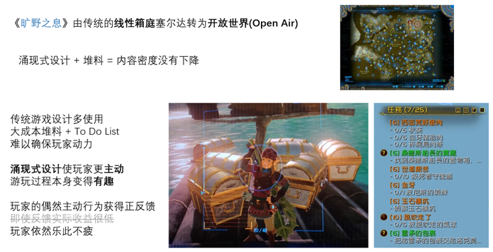

# 分析

## 云顶之弈回合循环

{width=100%}

## 《崩坏3》Rogue《往世乐土》

往世乐土从战斗关卡内外及收集/成长要素分类可分为个模块。 

1.	备战大厅/首界面：  
引导玩家选择各模块从而进入战斗/收集/养成系统，并将这些元素可视化地呈现以方便玩家交互找到入口，或直接点击UI以进入对应模块。  
（1） 雷律在其中作为玩家化身，在备战大厅场景内进行移动浏览，与其他模块的入口进行交互，体现为：大雕像-战斗入口，左前黄色看板-图鉴收藏，NPC聊天-剧情碎片，右前蓝色看板-装甲强化，左后展柜-追忆之皿，右后圆柱群-命定的歧路。同时，随乐土主线剧情影响B1（记不清了）和2L也存在交互元素/事件以推进剧情。这一备战大厅也并非乐土玩法刚开放时便有的。  
（2）此外，也可使用UI直接进入模块，左上为剧情与任务进度按钮卡片，右侧为战斗/收集/养成要素，并将不常用的模块入口折叠到“展开”按钮中。  
2.	剧情系统：  
碎片化剧情设置，能够很好且不割裂地融入肉鸽战斗玩法中，为玩家提供重复游玩动力。引入的新角色也增添了角色池活力，精美的角色设计和跌宕的情节编排也能充分调动玩家积极性。编剧老师们精心设计的世界观展现了一出壮美的史诗，各种名场面也被玩家津津乐道，一些梗/模因也利于在社群和玩家群体间传播。  
此外，剧情进度的显示模式也直观易懂。既有数轴般的剧情线展示，也有百分比/分数进度展示，方便玩家对剧情完成度查漏补缺。  
* PS：其实在同类型的肉鸽游戏中，《Hades》无疑是做的很好的一个，其对神话故事的解构和再创作，辅以其精美的2D手绘风，无疑抓人眼球，吸引了一众玩家，从漫展上其二创数量和质量便可见一斑（虽然大多是腐女向……）。但笔者个人并不是很喜欢《Hades》那种神神叨叨、有浓厚CRPG味道的文风，往世乐土这种包含JRPG风味的更加符合口味，其人物形象饱满，文案可读性强。且随版本更迭逐渐补全剧情的设定，一定程度上也杜绝了玩家为了快速看完被迫高强度游玩的问题，能让玩家更细水长流地体验故事，沉浸其中。  
3.	任务/成就系统：  
引导玩家推进剧情/游玩进度，奖励抉择之石帮助玩家强化战力（还有一个荣光助战），设置成就挑战通过纪念勋章吸引玩家重复挑战高难度。  
按章节结构设置任务奖励引导清晰，能够确保玩家知道自己下一步要做什么。所给奖励也将玩家引导到其他模块去进行强化，保证其游玩体验。  
4.	战斗系统：  
分为英桀试炼（剧情）、浅层序列、深层序列三种玩法。  
浅层序列帮助玩家快速熟悉女武神操作，并在首次完成时给予大量水晶奖励，鼓励玩家先完成此教学/练习关卡。其给予的装甲强化资源也支撑玩家度过前期。该玩法模式此前也大改过一次，目前集成为3个难度关卡更为凝练。  
深层序列允许玩家自主选择难度高低并挑战，并作为周常活动给予丰厚奖励，除了各种代币资源也有限时勋章获取。  
以上均属于进入战斗关卡前的模式区分，进入战斗关卡（包括出战界面）后主要有以下5个子模块，构成完整的战斗体验，笔者以深层序列为重点分析。  
（1）	关卡信息预览：方便玩家预览战斗内容，进行相应策略选择。每版本有两种难度因子切换，既影响关卡效果，也影响增益效果选择。  
（2）	增益/难度选择：增益效果选择允许玩家合理搭配策略，使用不同角色也能获得良好体验。难度选择帮助玩家进行符合自身水平的游玩，且不同难度获得不同奖励也能调动挑战的积极性，底部的奖励指示条也能清晰告诉玩家所设定难度是否满足获取条件。  
（3）	出战选择：允许玩家在正式进入关卡前选择女武神/支援女武神/人偶/追忆之证等战斗相关要素，并展示角色特殊调整列表帮助玩家理解玩法变动。追忆之证和支援女武神作为乐土的特色搭配玩法，也是养成/收集要素的一环，同时也提供更多策略搭配深度。  
（4）	房间/刻印选择：给予玩家更多决策乐趣和随机性体验，提升玩法新鲜感。战斗关卡进展属于类爬塔模式，玩家决策选择不同刻印的房间，并在完成当前房间后选择对应刻印的buff，通过散搭刻印或解锁核心刻印以后续获得增幅刻印从而实现丰富的搭配策略。  
（5）	敌人：不同属性/战斗模式/强度的敌人也不会使玩家审美疲劳。随难度因子更换的敌人也限定了当期的强势角色，让更多角色拥有出场机会。  
（6）	商店/休息点系统：战斗关卡内的商店，与战斗内获得的银币资源相关联，允许玩家强化/购买刻印，进一步强化战力，弥补随机性可能造成的不良体验。也允许玩家回血/更换追忆/支援，作为玩家的休息点/调整点，从而更好地投入到后续游玩过程。  
5.	装甲强化：  
引导玩家解锁和使用不同角色游玩，查看和学习操作攻略，随强化等级提升解锁特殊技，并给予水晶奖励（强化材料与战斗奖励关联）。  
养成要素之一，作为玩家战斗关卡内的实际操作角色，随版本不断更新可解锁角色池。对于版本新角色会添加养成强化，可以更快拿满奖励。角色特殊技能部分与角色星级/命座挂钩，鼓励玩家抽取高阶角色以降低战斗难度。  
6.	追忆之皿：  
补全角色设定，鼓励玩家积极获取“将逝的火种”以提高NPC羁绊，获取更多剧情对话/文本故事，并与追忆之证相挂钩，从而提升战斗体验/获得更多搭配策略。既是收集也是养成要素之一。  
7.	命定的歧路：  
Rougue-Lite要素，强化以提升玩家每局游玩的基础数值，降低战斗难度。作为养成要素之一，与战斗奖励“抉择之石”关联。四种类的技能树设计也给予玩家思考空间，有的放矢地选择强化顺序。  
8.	图鉴收集：  
方便玩家查阅游戏中的各种收集品以及剧情碎片，包括事件、追忆、刻印、物品等。针对刻印收集也给予少量水晶奖励，鼓励玩家尝试不同刻印搭配。同时方便玩家查阅剧情对话等，见证其游玩历程。  
9.	乐土商店：  
允许玩家使用战斗奖励“锈蚀之徽”兑换《崩3》游戏养成材料道具，包括角色碎片/印章等以提升阶级。区别于战斗关卡内的商店及乐土各种养成所需代币资源，而是与整个游戏养成挂钩，奖励更为实际化，对部分养成玩家来说更能调动积极性。  
10.	设定/攻略：  
补全角色/剧情/世界观设定，帮助玩家攻略乐土和熟悉操作。3个功能集成在乐土首界面的“展开”按钮种，包括妖精打字机、攻略、英桀关系网。  

模块逻辑关系图如图。
{width=100%}
正如上文对各模块的拆解所述，乐土作为肉鸽玩法，将剧情碎片化，和道具/刻印等一同作为收集要素，而装甲强化/命定的歧路等作为养成要素，各种代币与战斗奖励和人物奖励相关联，形成一个Feedback Loop/Core Loop，通过正反馈不断强化玩家游玩意愿，这些奖励既与乐土玩法内也与整个游戏的养成相挂钩，大都是为了更好的战斗体验所服务。如此逻辑关系设置既能满足剧情党的需要，也满足了强度党的追求。

经过多个版本迭代，乐土玩法已日臻完美，但仍存在一些体验上的问题，这些问题多与游玩难度相挂钩，因此解决需慎重，否则会导致挑战过于简单从而失去乐趣/减少日活。
其中一例为刻印的平衡性问题。这会降低关卡内玩家积极性，开始摆烂，甚至退出结算重开。即使改动平衡得当，削弱刻印也势必招致负面舆论。
随机获取的增益BUFF历来是肉鸽游戏的核心乐趣之一，只有BUFF强弱区分得当，整个用户体验旅程才能波澜起伏，带来更大的情绪波动及爽点。此前乐土也存在刻印选择单一、部分刻印超模的问题，策划对此进行了数次大改，终于平衡了刻印强度，让大家选择刻印的策略搭配更丰富。从乐土早期的赌蛇流，到后续的苦修称霸，每次削弱超模刻印亦会引起大多玩家不满。
随着乐土剧情完结，乐土逐渐作为周常玩法，玩家的最大动力是其水晶奖励，多数玩家一周可能只进行一局19800分的乐土，而确保这一局体验良好便成为关键。目前的刻印平衡足以保证每个版本有丰富的角色出场选择，但趣味性也略显不足，除了角色专属刻印外，通用刻印更缺少与角色的化学反应，这一化学反应并非指数值爆炸上的，而是指机制上的（譬如23年新年版本始源与雨四光）。如此游玩便更像是把一个策略丰富的RPG单一化，玩家只能按图索骥般地背公式，进一步使游玩兴趣消退。

肉鸽游戏随着独立游戏热潮而兴起，著名的柏林诠释也为其赋予了明确定义，但这一其实并不必要的界限也逐渐被模糊，Rogue-Like和Rogue-Lite的界限也日趋暧昧。为了降低游玩难度，like趋向于提升玩家自身技术，而lite通过养成/收集要素来提升玩家操纵角色的属性或解锁强力增益的可获取性，但目前大多肉鸽游戏或多或少都会有lite要素。作为一个有点“烂大街”的游戏品类，众多设计师也在不断探索。
如今，连肉鸽扛把子《以撒》都支持了双人模式，其DLC《忏悔》本身也拿来主义地借用了不少社区mod的点子。而《吸血鬼幸存者》又进一步扩展了肉鸽的上限，将无双、双摇杆等要素杂糅，创造出更极致的快感，后也有《土豆兄弟》之类的效仿者。
因此，肉鸽游戏的上限依然还未触达，许多新颖点子也可以从玩家社群中汲取学习，而加入多人联机的博弈要素也能产生1+1>2的化学反应。也期待更多制作者能维持对肉鸽的热情，带来更多让人眼前一亮的新颖设计。

## 二游市场

我个人是“有男不玩”的忠实拥趸，所以过去的原神、星铁等二游都没有深入游玩

- C like 舰队Collection 媚宅男性向
	- 美少女人设出发利于IP长线运营
	- 商业化方面对零氪、低氪玩家较为友好扩大受众
- B站等亚文化平台扩圈 一般向二游重视泛用户中的女性用户诉求
	- 挤压男性向生存空间
- 转折点 明日方舟 硬核不媚宅(后遭反噬)
	- 第一款以传统二次元项目思维（例如着力世界观与角色设计），吸引到了较多新生代泛用户的一般向二游
	- 阴阳师 火影忍者手游 仅在美术设计上引入了日式卡通风格
	- 原神早期男性向 现近1年(2022年冬初至2023年秋末)不推出5星限定女角色
- 二游市场饱和 角色品质要求高且需要竞品差异化
	- 二次元游戏主要售卖的是一些具有性向的事物  情绪价值和赛博性需求
	- 光靠角色和故事的“艺术魅力”，是不太值得玩家付出“648”和更多劳动
	- 群体平衡点 非受众玩家以集体审美评判角色
		- 情感需求与强度冲突 一般向厂商缺少与男玩家共情
	- **服务态度**重视感 不背叛基本盘 传播大于服务
- 市场调节
	- 舆论声量 男性玩家占比高，但女性玩家舆论热度反向促成了“有男不玩”的局面
	- 韩国性别对立严重 但没有有男不玩思潮(终极目的已成为韩国圈地日常)
	- 举报与和谐
		- 韩国主流凝视不产生实际干涉
	- 不患寡而患不均

二游发展逐渐去二次元化，国内只有《尘白》《碧蓝》还在坚守媚宅阵地，韩国则有两颗双子星

- 韩国二游成功原因
	- 产业集群 韩国从业者交流情报异常频繁，厂商共同进步，缺少保密限制导致强公关意识，不会轻易展示价值倾向
	- 教育体系 人才多、项目成本低(如低价美术，关联二游品质) 
	- 开发模式 项目规范、研发效率高 
		- 项目在较少“转向”的情况下就成功上线(竞争激烈，2年做粥足矣) 
		- 与中国二游市场流行的“唯成功论”相反 低立项资本半年回本就可以算成功
		- 低工资排除无关员工 招爱好者 低专业高文化
	- 市场普遍认知 重视忠诚玩家的传统并针对施展运营策略
		- 韩国厂商和基本盘玩家一直站在一起 不像中国厂商碰舆论装死
		- 韩国玩家会更加主动地去玩特定厂商的游戏 而不是等待宣发和推广
			- Nexon去年广告费占销售额5% 韩国大部分不超过10%
			- 研发组则能够拿到70%以上的销售额

近年来韩国二游双子星《Nikke》和《蔚蓝档案》火爆，与国内二游大环境截然相反

- 趋势 中国追求大市场和泛用户与韩国追求游戏出海和忠诚用户截然相反
	- 开发模式 专业的人做专业的事
		- 二游市场的资本热钱减少 人员更专业
		- 二游数量减少 质量提高
	- 市场普遍认知 社区生态和市场问题
		- 版号限制玩家不了解正规单机平台
		- 中国大多数玩家未经历韩国MMO类似磨练 
			- 不了解游戏的销售、研发和营销模式
			- 攻击性泛滥 很难清晰明确表达自身诉求 形成较统一的有效观点
				- 如无脑卡车堵门抗议Nikke专武被韩国玩家嘲讽
			- 缺乏玩家厂商斗争史 玩家不切实际幻想 厂商不知应对方式
				- 如明文退款诉求 反映服务价值、保障、具体运营情况知情权
		- 厂商应该对玩家的意见做出迅速、及时的反应 禁止沉默

## 《旷野之息》与涌现式设计

交互设计课时个人汇报的PPT
{width=100%}
{width=100%}
{width=100%}
{width=100%}
{width=100%}
{width=100%}

## 《UNO Mobile》海外新手玩家洞察

工作坊的小组汇报

通过可用性测试和问卷研究UNO Mobile新手玩家策略掌握程度对其留存意愿的影响，发现策略掌握度似乎和留存意愿关系不大。
可能原因：

- 游戏内因素
    - 休闲游戏上手容易精通难，大部分玩家不求精通、只为消遣
    - 低保机制，多种来源的金币获取能保障玩家继续游戏
    - 时长控制恰当，碎片化时间，玩家黏性大
    - 玩家个人的胜负心、求胜欲使其继续游戏
- 游戏外因素
    - 测试时间较短，玩家策略水平成长幅度有限
    - 问卷设置不合理，不能很好地反映玩家真实心声
    - 样本招募量少，无法进行充分的量化和数据分析
{width=100%}
{width=100%}

列出问题清单并给出优化建议。
{width=100%}
{width=100%}