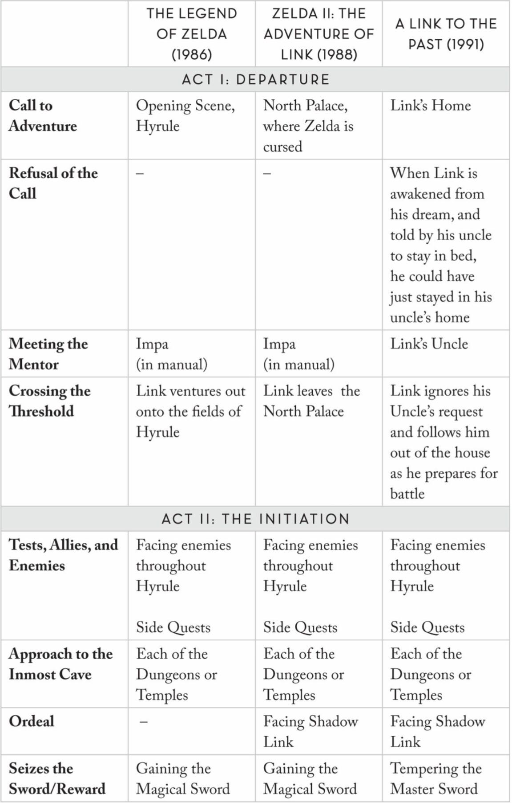
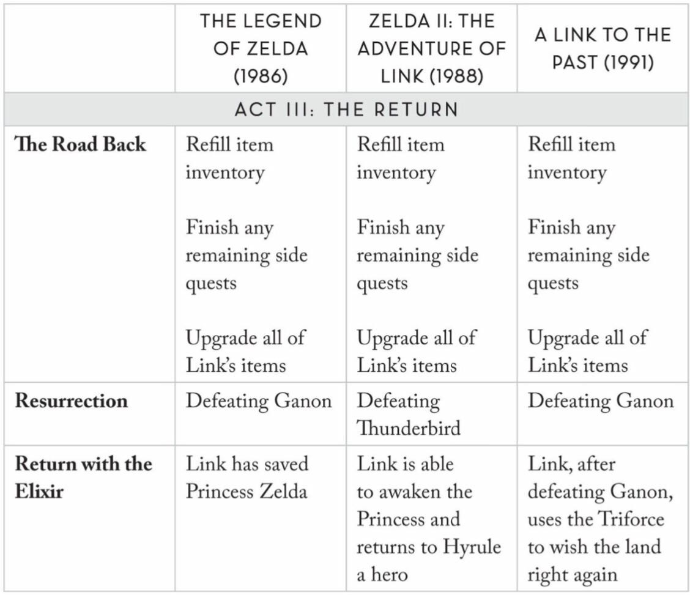
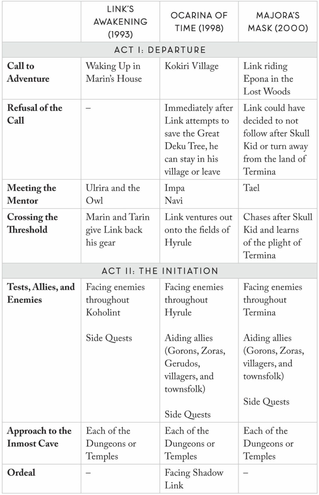
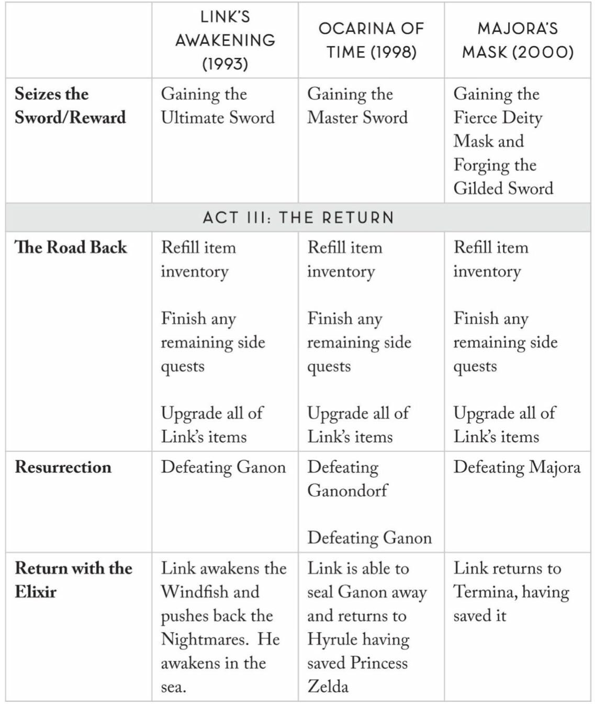
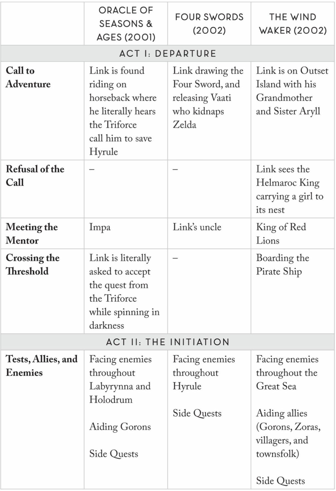
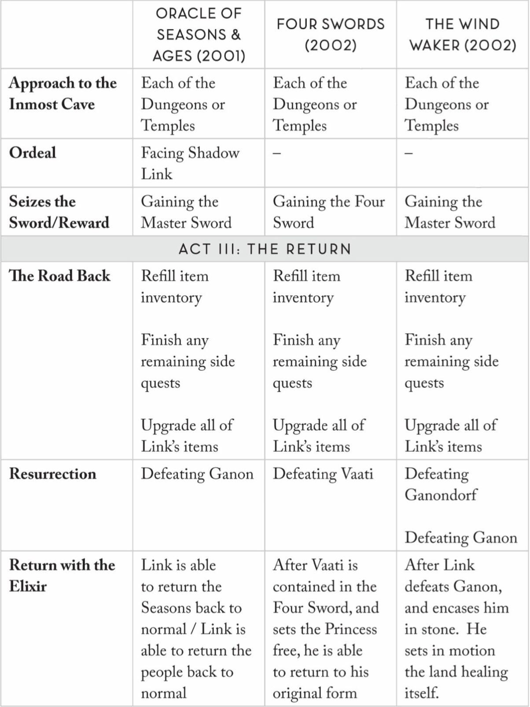
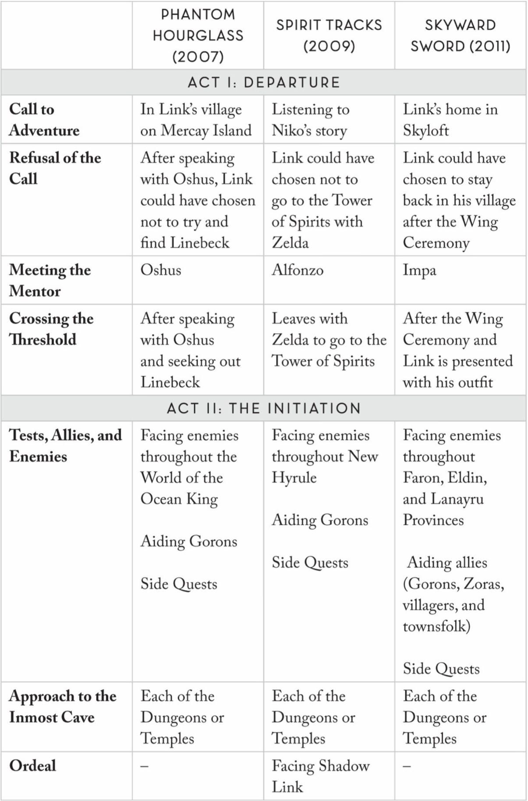
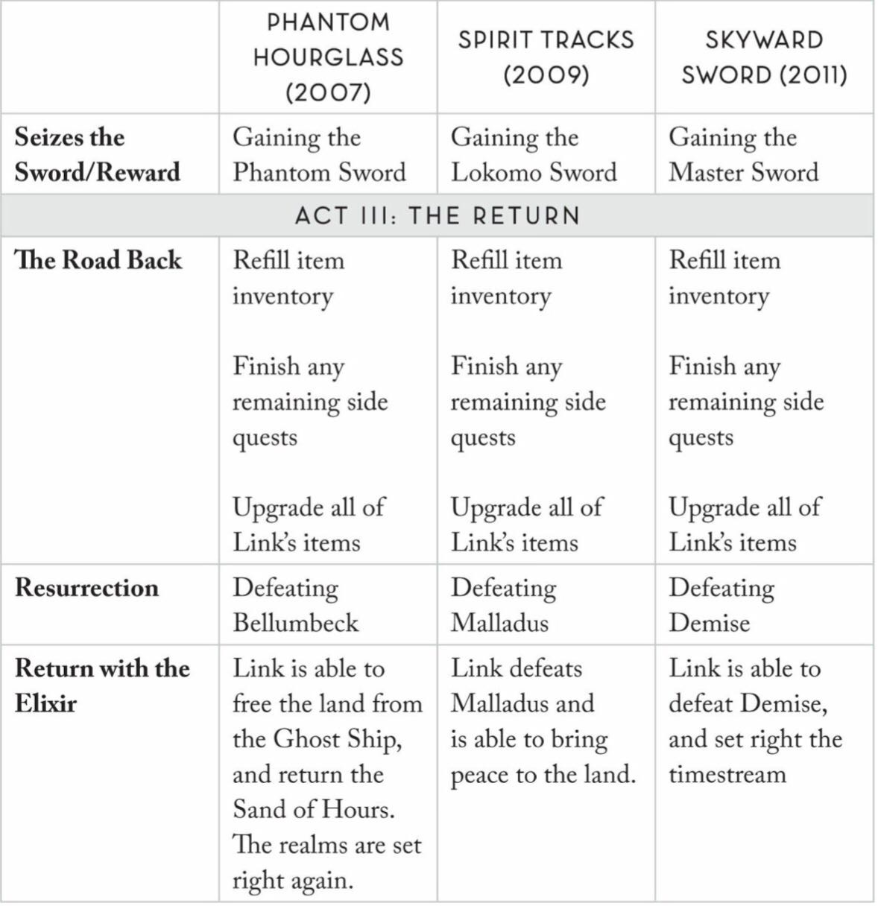
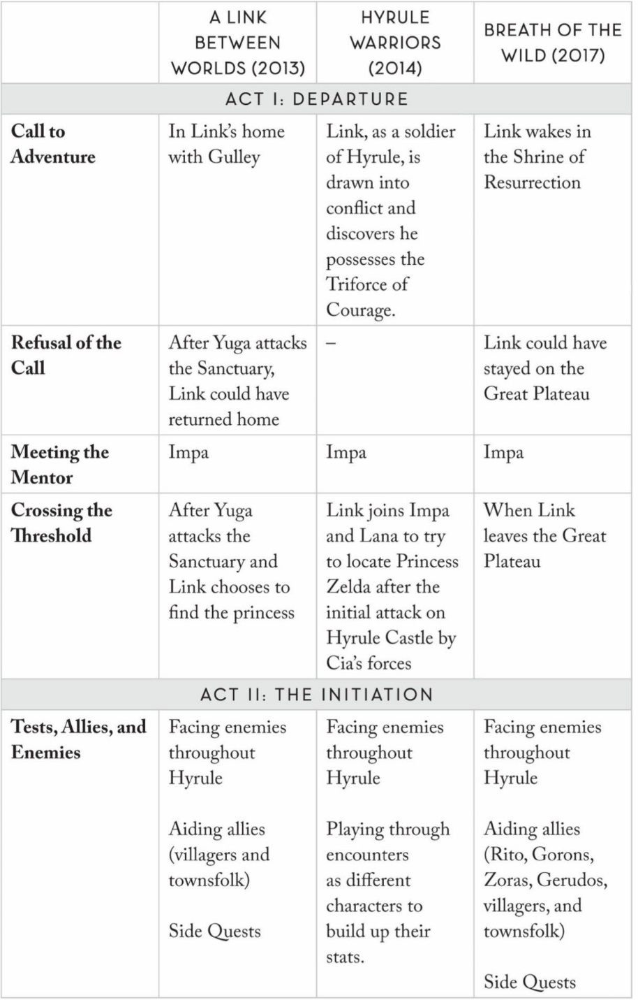
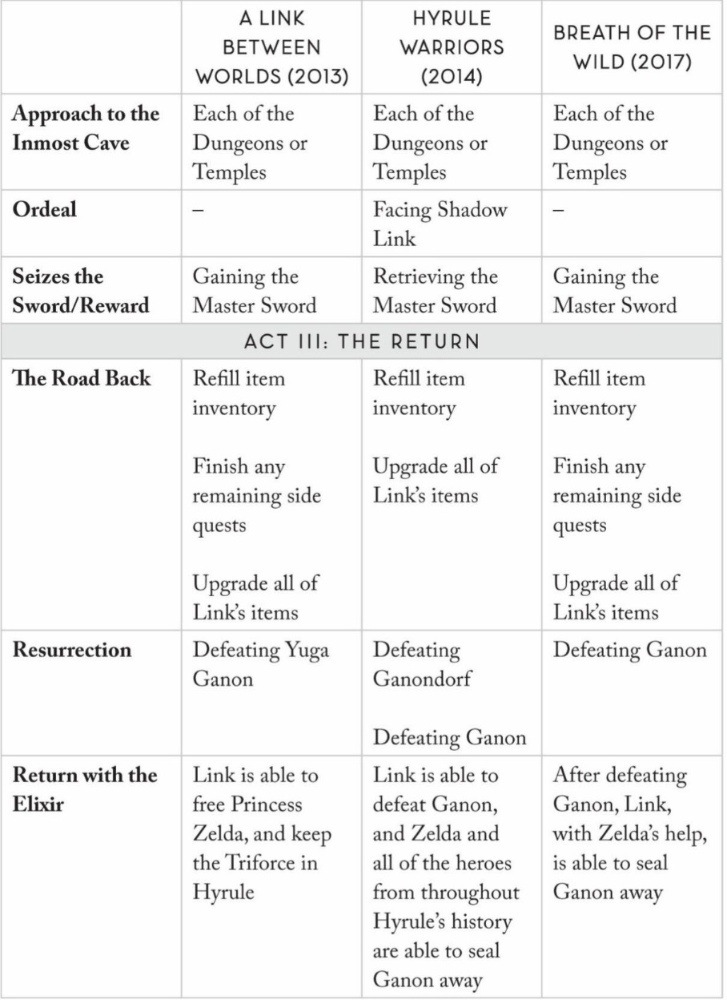

# 杂记

想到什么看到什么就记什么

## 品类特征

1. 二次元类：通过优秀的立绘、剧情、世界观包装，为玩家提供情感支持，脱胎于JRPG，目前在手游中最为常见。目前大陆二游市场格局已定，之后会是细分赛道的时代，是一般向还是男/女性向，有男不玩思潮会不会再度爆发，政策会怎么限制，都有待时间解答。
2. 开放世界：最高明的做法是隐性选择定制化玩家冒险体验，地图与地形设计为探索驱动服务，激发玩家自主探索兴趣并形成、网状目标选择，通过涌现式设计不断营造新鲜感，如《塞尔达传说：旷野之息》。开放世界探索是地牢爬行的终极形态，但由于工作量问题，最优秀的巧思往往在小箱庭中。
3. RPG：在游戏中获得第二人生，代入感强，风格鲜明的剧情文本，英雄之旅小说结构的重新结构。同时在合理build后爽看爆数字也是一大爽点，地牢爬行和收集道具也别有乐趣。但大多JRPG的支线还停留在通马桶的阶段，味同嚼蜡。目前也缺少本格现代都市题材的作品，只有《如龙》《审判之逝》《莎木》等作品，名越稔洋被挖到网易后一直没有新作消息。
4. MOBA：高强度快节奏，既有DOTA一样注重战术策略的，也有LOL一样偏战斗、有格斗游戏感的，每次平衡性改动都会让游戏环境焕然一新，而独特的玩法比如装备搭配也能带来像RPG般的快乐。
5. 卡牌类：如今的二游本质上也都是卡牌游戏，而自走棋游戏属于战棋，勉强也可以算卡牌。卡牌更加注重build，得益于画面等包装的不断进步，游玩体验的刺激感也越强。
6. Roguelike：like和lite的界限已被混淆，为了调节难度和延长游戏寿命，肉鸽多加入了成长性收集要素，而开荒过程通常在开头有趣，中段变得无聊。一些说明性文本如公式和道具数值等是否该被选择性隐藏，就像《以撒》那样，但这会不利于扩大受众。吸血鬼like类游戏也为肉鸽打了针强心剂，指了条新路。
7. 模拟经营类：种田一直是玩家们津津乐道的，贴近生活的选题也能带来更多受众，《牧场物语》也分化出了《符文工房》打开二次元赛道。且模拟经营作为养成要素，也能很好地与战斗等其他玩法结合，如《天穗之咲稻姬》。通过多个产业流水线即对应产出道具实现工业循环，也会有种资本主义革命的乐趣。

在盛趣实习时盘了遍23年付费游戏榜的分类，强迫症犯了

## 王国之泪的系统

余料锻造  
这才是系统 而不仅仅是功能  
RPG游戏 素有材料道具冗余的问题  
都将其转化为相同代币又损害世界观  
*神之天平* 将余料用作锻造称重砝码  
*王国之泪* 将余料用作装备融合耗材  

空岛与大地  
*天空之剑* 中早有这一立体地图概念 但实现方式粗糙  
如今的技术力可以实现从高空坠落俯瞰大地

## 林克的英雄之旅

摘自某野鸡心理学书

其一  
{width=49%}
{width=49%}

其二  
{width=49%}
{width=49%}

其三  
{width=49%}
{width=49%}

其四  
{width=49%}
{width=49%}

其五  
{width=49%}
{width=49%}

